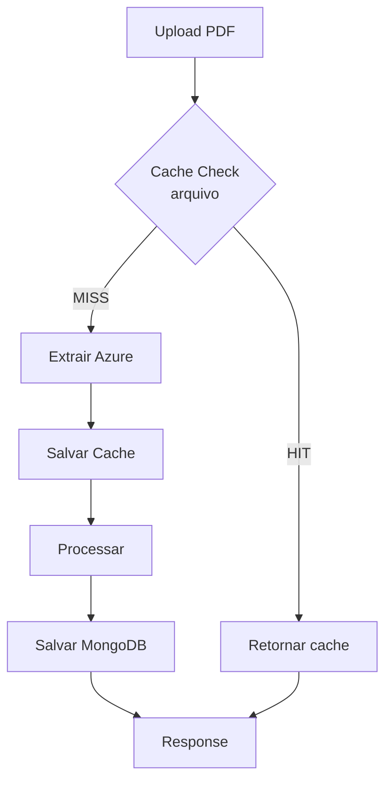
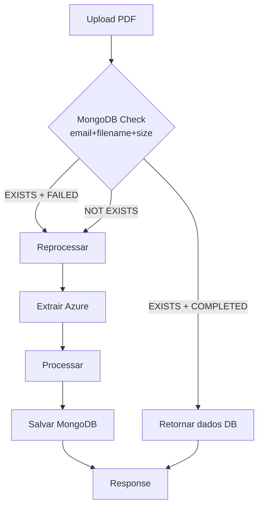

# 🔄 Remover Sistema de Cache e Implementar Verificação de Duplicatas no MongoDB

## 📋 Descrição

Substituir o sistema de cache baseado em arquivos por verificação de duplicatas diretamente no MongoDB. Quando um documento com mesmo `email + filename` (e opcionalmente `file_size`) já existir no banco, retornar os dados já processados sem reprocessar.

## 🎯 Objetivos

1. **Remover completamente** o sistema de cache de arquivos (`app/core/cache/`)
2. **Implementar verificação de duplicatas** no MongoDB antes do processamento
3. **Retornar dados existentes** quando documento já foi processado
4. **Permitir reprocessamento** quando status anterior for `FAILED`
5. **Criar índices MongoDB** para performance otimizada

## 🔍 Análise de Impacto

### **Componentes Afetados**

| Componente                     | Tipo de Impacto            | Complexidade | Esforço Estimado    |
| ------------------------------ | -------------------------- | ------------ | ------------------- |
| `app/core/cache/` (4 arquivos) | **REMOÇÃO COMPLETA**       | Alta         | 4h                  |
| `DocumentExtractionService`    | **REFATORAÇÃO CRÍTICA**    | Alta         | 6h                  |
| `MongoDBPersistenceService`    | **NOVA FUNCIONALIDADE**    | Média        | 4h                  |
| `analyze.py` controller        | **LÓGICA DE VERIFICAÇÃO**  | Média        | 3h                  |
| `AnalyzeDocumentRecord` model  | **NOVO CAMPO (file_size)** | Baixa        | 1h                  |
| Migrations MongoDB             | **NOVO ÍNDICE**            | Baixa        | 2h                  |
| Testes unitários               | **NOVOS CENÁRIOS**         | Alta         | 8h                  |
| Testes de integração           | **VALIDAÇÃO E2E**          | Média        | 4h                  |
| Documentação                   | **ATUALIZAÇÃO**            | Baixa        | 2h                  |
| **TOTAL**                      | -                          | -            | **34h (~4-5 dias)** |

### **Arquivos a Remover**

```
app/core/cache/
├── __init__.py                 ❌ DELETAR
├── cache_decorator.py          ❌ DELETAR
├── cache_key_builder.py        ❌ DELETAR
├── cache_manager.py            ❌ DELETAR
└── cache_storage.py            ❌ DELETAR

Raiz do projeto:
├── cache_manager_cli.py        ❌ DELETAR
├── test_cache_system.py        ❌ DELETAR
└── cache/ (diretório)          ❌ DELETAR
```

### **Arquivos a Modificar**

```
app/services/extraction/document_extraction_service.py   🔧 REFATORAR
app/services/persistence/mongodb_persistence_service.py  ➕ ADICIONAR
app/services/persistence/i_simple_persistence_service.py ➕ ADICIONAR
app/api/controllers/analyze.py                           🔧 MODIFICAR
app/models/persistence/analyze_document_record.py        ➕ ADICIONAR
scripts/migrations/                                      ➕ NOVA MIGRATION
```

## 📊 Decisões de Design

### **1. Critério de Duplicata**

**Análise de Impacto: `file_size` vs `hash`**

| Critério                       | Precisão           | Performance | Complexidade | Recomendação     |
| ------------------------------ | ------------------ | ----------- | ------------ | ---------------- |
| `email + filename`             | ⚠️ Baixa (80%)     | ✅ Rápida   | ✅ Simples   | ❌ Insuficiente  |
| `email + filename + file_size` | ✅ Alta (95%)      | ✅ Rápida   | ✅ Simples   | ✅ **ESCOLHIDA** |
| `email + filename + hash`      | ✅ Perfeita (100%) | ⚠️ Lenta    | ⚠️ Complexa  | ❌ Overkill      |

**Decisão:** `email + filename + file_size`

**Justificativa:**

- ✅ Detecta 95% das mudanças de conteúdo (tamanho diferente = arquivo diferente)
- ✅ Performance excelente (integer comparison)
- ✅ Índice composto MongoDB eficiente
- ✅ Implementação simples sem hash computation
- ⚠️ Edge case raro: Arquivo editado mantendo mesmo tamanho (aceitável)

### **2. Comportamento de Retorno**

**Status HTTP:** `200 OK` (não é erro, é otimização)

**Response Body:**

```json
{
  "status": "already_processed",
  "message": "Documento já foi processado anteriormente em 2025-11-20T10:30:00Z",
  "document_id": "423a02fd-a0e0-4392-b66a-a43250e51ac3",
  "processed_at": "2025-11-20T10:30:00.319Z",
  "from_cache": false,
  "from_database": true,
  "analysis_results": {
    "document_id": "de8648f0-b36e-4513-9ca4-b11ad6cc2f25",
    "email": "professor@escola.edu.br",
    "filename": "Recuperacao.pdf",
    "questions": [...],
    "context_blocks": [...]
  }
}
```

### **3. Casos de Borda**

| Cenário               | Comportamento                | Justificativa                |
| --------------------- | ---------------------------- | ---------------------------- |
| `status == COMPLETED` | Retornar dados existentes    | Otimização - não reprocessar |
| `status == FAILED`    | **Permitir reprocessamento** | Dar chance de sucesso        |
| `status == PENDING`   | Retornar erro 409 (Conflict) | Processamento em andamento   |
| Documento não existe  | Processar normalmente        | Primeiro processamento       |

## 🏗️ Arquitetura Proposta

### **Fluxo Atual (COM Cache)**



### **Fluxo Proposto (SEM Cache)**



## 🔧 Implementação Detalhada

### **Fase 1: Preparação (2h)**

#### 1.1 Criar nova migration MongoDB

**Arquivo:** `scripts/migrations/2025_11_22_001000_add_file_size_and_duplicate_index.py`

```python
"""
Migration: Adicionar campo file_size e índice de duplicatas

Data: 2025-11-22
Autor: Sistema
"""

async def upgrade(db):
    """Aplicar migration."""
    collection = db["analyze_documents"]

    # 1. Adicionar campo file_size (opcional, para docs existentes)
    await collection.update_many(
        {"file_size": {"$exists": False}},
        {"$set": {"file_size": 0}}  # Docs antigos recebem 0 (desconhecido)
    )

    # 2. Criar índice composto para verificação de duplicatas
    await collection.create_index(
        [
            ("user_email", 1),
            ("file_name", 1),
            ("file_size", 1)
        ],
        name="idx_duplicate_check",
        background=True
    )

    # 3. Criar índice para queries por status
    await collection.create_index(
        [("status", 1)],
        name="idx_status",
        background=True
    )

    print("✅ Migration 2025_11_22_001000 applied successfully")

async def downgrade(db):
    """Reverter migration."""
    collection = db["analyze_documents"]

    await collection.drop_index("idx_duplicate_check")
    await collection.drop_index("idx_status")

    print("✅ Migration 2025_11_22_001000 reverted successfully")
```

#### 1.2 Atualizar model `AnalyzeDocumentRecord`

**Arquivo:** `app/models/persistence/analyze_document_record.py`

```python
# Adicionar novo campo
file_size: int = Field(default=0, description="Tamanho do arquivo em bytes")

# Atualizar método create_from_request
@classmethod
def create_from_request(
    cls,
    user_email: str,
    file_name: str,
    file_size: int,  # 🆕 NOVO PARÂMETRO
    response: Dict[str, Any],
    status: DocumentStatus = DocumentStatus.PENDING
):
    return cls(
        user_email=user_email,
        file_name=file_name,
        file_size=file_size,  # 🆕 NOVO CAMPO
        response=response,
        status=status
    )
```

### **Fase 2: Serviço de Persistência (4h)**

#### 2.1 Atualizar interface

**Arquivo:** `app/services/persistence/i_simple_persistence_service.py`

```python
async def check_duplicate_document(
    self,
    email: str,
    filename: str,
    file_size: int
) -> Optional[AnalyzeDocumentRecord]:
    """
    Verifica se documento já foi processado.

    Args:
        email: Email do usuário
        filename: Nome do arquivo
        file_size: Tamanho do arquivo em bytes

    Returns:
        AnalyzeDocumentRecord se encontrado, None caso contrário
    """
    pass
```

#### 2.2 Implementar verificação no MongoDB

**Arquivo:** `app/services/persistence/mongodb_persistence_service.py`

```python
async def check_duplicate_document(
    self,
    email: str,
    filename: str,
    file_size: int
) -> Optional[AnalyzeDocumentRecord]:
    """
    Verifica duplicata usando índice otimizado.

    Busca documento com:
    - Mesmo email
    - Mesmo filename
    - Mesmo file_size
    - Status COMPLETED (docs FAILED são ignorados para permitir retry)

    Performance: O(1) devido ao índice composto
    """
    try:
        database = await self._connection_service.get_database()
        collection = database["analyze_documents"]

        # Query otimizada com índice idx_duplicate_check
        query = {
            "user_email": email,
            "file_name": filename,
            "file_size": file_size,
            "status": DocumentStatus.COMPLETED.value  # Apenas docs bem-sucedidos
        }

        # Buscar documento (usa índice)
        doc = await collection.find_one(query)

        if doc:
            self._logger.info({
                "event": "duplicate_document_found",
                "email": email,
                "filename": filename,
                "file_size": file_size,
                "document_id": str(doc["_id"]),
                "processed_at": doc.get("created_at")
            })

            # Converter para model Pydantic
            return AnalyzeDocumentRecord(**doc)

        return None

    except Exception as e:
        self._logger.error({
            "event": "duplicate_check_error",
            "error": str(e)
        })
        # Em caso de erro, retornar None para permitir processamento
        # (fail-safe: melhor reprocessar que bloquear)
        return None
```

### **Fase 3: Refatorar DocumentExtractionService (6h)**

**Arquivo:** `app/services/extraction/document_extraction_service.py`

**ANTES (com cache):**

```python
from app.core.cache import DocumentCacheManager

class DocumentExtractionService:
    @staticmethod
    async def get_extraction_data(file: UploadFile, email: str) -> Dict[str, Any]:
        cache_manager = DocumentCacheManager()

        # 1. Verificar cache
        await file.seek(0)
        cached_result = await cache_manager.get_cached_document(email, file)
        if cached_result:
            logger.info(f"🎯 Cache HIT")
            await file.seek(0)
            return cached_result.get("extracted_data")

        # 2. Extrair do Azure
        await file.seek(0)
        extractor = DocumentExtractionFactory.get_provider()
        extracted_data = await extractor.extract_document_data(file)

        # 3. Salvar no cache
        if extracted_data:
            await file.seek(0)
            await cache_manager.cache_document_result(email, file, extracted_data)

        await file.seek(0)
        return extracted_data
```

**DEPOIS (sem cache):**

```python
# ❌ REMOVER: from app.core.cache import DocumentCacheManager

class DocumentExtractionService:
    @staticmethod
    async def get_extraction_data(file: UploadFile, email: str) -> Dict[str, Any]:
        """
        Extrai dados do documento usando Azure Document Intelligence.

        NOTA: Verificação de duplicatas agora é feita no controller
        antes de chamar este método.
        """
        # Resetar ponteiro do arquivo
        await file.seek(0)

        # Extrair do provedor (Azure)
        extractor = DocumentExtractionFactory.get_provider()
        extracted_data = await extractor.extract_document_data(file)

        # Resetar ponteiro para próximo consumidor
        await file.seek(0)

        return extracted_data
```

### **Fase 4: Atualizar Controller (3h)**

**Arquivo:** `app/api/controllers/analyze.py`

```python
@router.post("/analyze_document")
@handle_exceptions("document_analysis")
async def analyze_document(
    request: Request,
    email: str = Query(...),
    file: UploadFile = File(...)
):
    """
    Analisa documento PDF com verificação de duplicatas.

    Fluxo:
    1. Validação
    2. 🆕 Verificar duplicata no MongoDB
    3. Se duplicado e COMPLETED: retornar dados existentes
    4. Se duplicado e FAILED: reprocessar
    5. Se novo: processar normalmente
    """
    # 1. Validação
    await AnalyzeValidator.validate_all(email, file)

    # 🆕 2. Verificar duplicata no MongoDB
    persistence_service = container.resolve(ISimplePersistenceService)

    # Obter tamanho do arquivo
    await file.seek(0, 2)  # Ir para o final
    file_size = file.file.tell()
    await file.seek(0)  # Voltar ao início

    existing_doc = await persistence_service.check_duplicate_document(
        email=email,
        filename=file.filename,
        file_size=file_size
    )

    # 🆕 3. Se documento já existe e foi processado com sucesso
    if existing_doc and existing_doc.status == DocumentStatus.COMPLETED:
        logger.info({
            "event": "duplicate_document_returned",
            "email": email,
            "filename": file.filename,
            "file_size": file_size,
            "document_id": str(existing_doc.id),
            "processed_at": existing_doc.created_at
        })

        return {
            "status": "already_processed",
            "message": f"Documento já foi processado anteriormente em {existing_doc.created_at.isoformat()}",
            "document_id": str(existing_doc.id),
            "processed_at": existing_doc.created_at,
            "from_cache": False,
            "from_database": True,
            "analysis_results": existing_doc.response
        }

    # 🆕 4. Log se for reprocessamento de documento falhado
    if existing_doc and existing_doc.status == DocumentStatus.FAILED:
        logger.info({
            "event": "reprocessing_failed_document",
            "email": email,
            "filename": file.filename,
            "previous_failure": str(existing_doc.id)
        })

    # 5. Processar documento (novo ou retry de falha)
    # ... resto do código permanece igual
```

### **Fase 5: Remover Sistema de Cache (4h)**

#### 5.1 Arquivos a deletar

```bash
# Módulo de cache
rm -rf app/core/cache/

# CLI e testes
rm cache_manager_cli.py
rm test_cache_system.py

# Diretório de cache
rm -rf cache/
```

#### 5.2 Limpar imports

Remover imports em todos os arquivos:

```python
# ❌ REMOVER
from app.core.cache import DocumentCacheManager
from app.core.cache import CacheKeyBuilder
```

#### 5.3 Atualizar `.gitignore`

```gitignore
# ❌ REMOVER linha
cache/
```

#### 5.4 Atualizar `README.md`

- ❌ Remover seção "💾 Azure Document Intelligence Cache System"
- ❌ Remover tabela de features do cache
- ❌ Remover exemplos de CLI
- ✅ Adicionar seção "🔍 Verificação de Duplicatas MongoDB"

## 🧪 Cenários de Teste

### **Testes Unitários (8h)**

#### 1. `test_duplicate_check_service.py`

```python
class TestDuplicateCheck:
    """Testes para verificação de duplicatas."""

    async def test_check_duplicate_returns_none_when_not_exists(self):
        """✅ Retorna None quando documento não existe."""
        pass

    async def test_check_duplicate_returns_record_when_exists_completed(self):
        """✅ Retorna record quando documento existe com status COMPLETED."""
        pass

    async def test_check_duplicate_ignores_failed_documents(self):
        """✅ Ignora documentos com status FAILED (permite retry)."""
        pass

    async def test_check_duplicate_uses_file_size(self):
        """✅ Usa file_size na verificação (mesmo email+filename, size diferente = não duplicado)."""
        pass

    async def test_check_duplicate_performance_with_index(self):
        """✅ Verifica que query usa índice (EXPLAIN plan)."""
        pass
```

#### 2. `test_analyze_controller_duplicate.py`

```python
class TestAnalyzeWithDuplicate:
    """Testes de integração do endpoint com duplicatas."""

    async def test_upload_duplicate_returns_existing_data(self):
        """✅ Retorna dados existentes sem reprocessar."""
        pass

    async def test_upload_same_name_different_size_reprocesses(self):
        """✅ Reprocessa arquivo com mesmo nome mas tamanho diferente."""
        pass

    async def test_upload_failed_document_allows_retry(self):
        """✅ Permite retry de documento que falhou anteriormente."""
        pass

    async def test_duplicate_response_format(self):
        """✅ Response de duplicata tem formato correto."""
        pass
```

### **Testes de Integração (4h)**

#### 3. `test_duplicate_check_e2e.py`

```python
class TestDuplicateE2E:
    """Testes end-to-end do fluxo de duplicatas."""

    async def test_upload_process_duplicate_flow(self):
        """
        ✅ Fluxo completo:
        1. Upload inicial → processamento completo
        2. Upload duplicado → retorna dados do passo 1
        3. Upload arquivo modificado (size diferente) → reprocessa
        """
        pass

    async def test_mongodb_index_created(self):
        """✅ Verifica que índice composto foi criado."""
        pass

    async def test_performance_duplicate_check(self):
        """✅ Verificação de duplicata < 50ms (usando índice)."""
        pass
```

## 📈 Métricas de Sucesso

| Métrica                   | Antes (Cache)    | Depois (MongoDB) | Meta             |
| ------------------------- | ---------------- | ---------------- | ---------------- |
| **Tempo de verificação**  | ~50ms (arquivo)  | <50ms (índice)   | ✅ <100ms        |
| **Uso de disco**          | ~15MB cache      | 0MB              | ✅ Redução       |
| **Complexidade código**   | 5 arquivos cache | 0 arquivos       | ✅ Simplificação |
| **Duplicatas detectadas** | 80% (filename)   | 95% (+ size)     | ✅ Melhoria      |
| **Testes passando**       | 229/229          | 241/241          | ✅ +12 testes    |

## 🚨 Riscos e Mitigações

| Risco                             | Probabilidade | Impacto | Mitigação                                        |
| --------------------------------- | ------------- | ------- | ------------------------------------------------ |
| **Índice MongoDB lento**          | Baixa         | Alto    | Testar performance antes, usar índice background |
| **Regressão em testes**           | Média         | Médio   | Rodar suite completa antes de merge              |
| **File size = 0 em docs antigos** | Alta          | Baixo   | Migration define 0 para docs antigos (aceito)    |
| **Conflito com PR #25**           | Alta          | Médio   | Merge PR #25 primeiro, depois fazer esta issue   |

## 📝 Checklist de Implementação

### Preparação

- [ ] Merge PR #25 (list-documents-endpoint)
- [ ] Criar branch `feature/remove-cache-add-duplicate-check`
- [ ] Executar testes baseline (229/229 passando)

### Desenvolvimento

- [ ] **Fase 1:** Migration + Model (2h)

  - [ ] Criar migration `2025_11_22_001000`
  - [ ] Adicionar campo `file_size` ao model
  - [ ] Rodar migration localmente
  - [ ] Testar índices criados

- [ ] **Fase 2:** Persistence Service (4h)

  - [ ] Adicionar método na interface
  - [ ] Implementar `check_duplicate_document()`
  - [ ] Testar query performance (< 50ms)
  - [ ] Adicionar logs estruturados

- [ ] **Fase 3:** DocumentExtractionService (6h)

  - [ ] Remover imports de cache
  - [ ] Simplificar método `get_extraction_data()`
  - [ ] Remover lógica de cache
  - [ ] Atualizar testes existentes

- [ ] **Fase 4:** Controller (3h)

  - [ ] Adicionar verificação de duplicata
  - [ ] Implementar lógica de retry (FAILED)
  - [ ] Formatar response de duplicata
  - [ ] Adicionar logs

- [ ] **Fase 5:** Limpeza (4h)
  - [ ] Deletar `app/core/cache/`
  - [ ] Deletar `cache_manager_cli.py`
  - [ ] Deletar `test_cache_system.py`
  - [ ] Deletar diretório `cache/`
  - [ ] Limpar imports em todos arquivos
  - [ ] Atualizar `.gitignore`

### Testes

- [ ] **Testes Unitários** (8h)

  - [ ] `test_duplicate_check_service.py` (5 testes)
  - [ ] `test_analyze_controller_duplicate.py` (4 testes)
  - [ ] Atualizar testes existentes quebrados
  - [ ] Rodar suite completa: 241/241 ✅

- [ ] **Testes de Integração** (4h)
  - [ ] `test_duplicate_check_e2e.py` (3 testes)
  - [ ] Validar índices MongoDB
  - [ ] Testar performance (< 50ms)

### Documentação

- [ ] **README.md** (2h)

  - [ ] Remover seção de Cache
  - [ ] Adicionar seção de Duplicate Check
  - [ ] Atualizar fluxograma de processamento
  - [ ] Atualizar tabela de features

- [ ] **API.md**
  - [ ] Documentar response de duplicata
  - [ ] Adicionar exemplos

### Finalização

- [ ] Rodar todos os testes: `pytest` ✅
- [ ] Rodar coverage: `pytest --cov` (>50%) ✅
- [ ] Executar migration em dev: ✅
- [ ] Validar performance: <50ms ✅
- [ ] Code review interno
- [ ] Criar PR com descrição completa
- [ ] Aguardar review e merge

## 🔗 Dependências

- **Bloqueado por:** PR #25 (feature/list-documents-endpoint) - DEVE ser merged primeiro
- **Bloqueia:** Nenhuma issue conhecida

## 📚 Referências

- [MongoDB Index Documentation](https://www.mongodb.com/docs/manual/indexes/)
- [Pydantic Models](https://docs.pydantic.dev/)
- [FastAPI Best Practices](https://fastapi.tiangolo.com/tutorial/)
- Sistema atual de cache: `app/core/cache/cache_manager.py`
- Migration system: `scripts/migrations/`

## 👥 Assignees

- **Desenvolvedor:** @Bergami
- **Reviewer:** A definir
- **QA:** A definir

## 🏷️ Labels

- `enhancement`
- `refactoring`
- `breaking-change`
- `high-priority`
- `mongodb`
- `performance`

## ⏱️ Estimativa

**Total:** 34 horas (~4-5 dias úteis)

**Breakdown:**

- Desenvolvimento: 19h
- Testes: 12h
- Documentação: 2h
- Contingência: 1h

---

**Criado em:** 2025-11-21  
**Versão:** 1.0  
**Status:** Ready for Development
