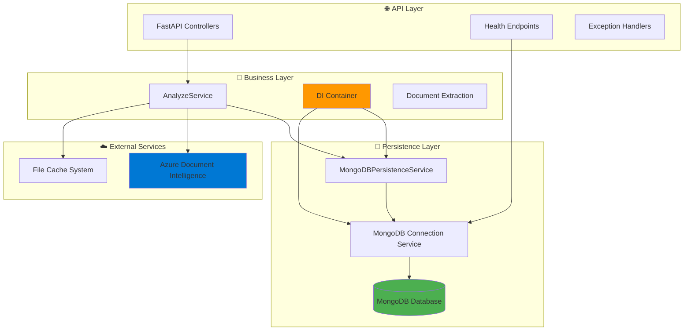
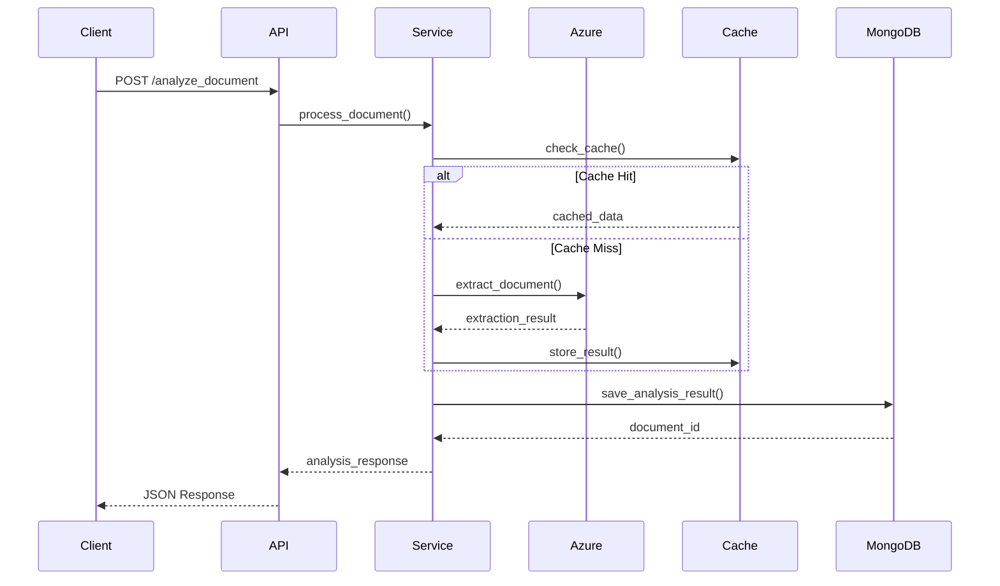

# SmartQuest - Architecture & Technology

Documentação técnica da arquitetura e tecnologias utilizadas no SmartQuest.

## 🛠️ Tech Stack

| Tecnologia | Versão | Propósito |
|------------|--------|-----------|
| **Python** | 3.9+ | Linguagem principal |
| **FastAPI** | Latest | Framework web + API REST |
| **MongoDB** | 7.0 | Banco de dados NoSQL |
| **PyMongo/Motor** | Latest | Drivers MongoDB (sync/async) |
| **Pydantic** | Latest | Validação e serialização |
| **Azure Document Intelligence** | 2023-07-31 | Extração de texto/imagens |
| **Docker** | Latest | Containerização |
| **Pytest** | Latest | Framework de testes |

## 🏗️ Arquitetura do Sistema

### 📊 **Diagrama de Componentes**



### 🔄 **Fluxo de Processamento**



## 🏛️ Arquitetura em Camadas

### 1. **🌐 API Layer**
```python
app/api/
├── controllers/analyze.py      # Endpoint principal
├── controllers/health.py       # Health checks
└── routers.py                  # Configuração de rotas
```

**Responsabilidades:**
- Validação de entrada (Pydantic)
- Serialização de resposta
- Exception handling
- Health monitoring

### 2. **🧠 Business Layer**
```python
app/services/
├── analyze_service.py          # Orquestração principal
├── providers/                  # Provedores Azure
└── storage/                    # Serviços de armazenamento
```

**Responsabilidades:**
- Lógica de negócio
- Orquestração de serviços
- Processamento de documentos
- Cache management

### 3. **💾 Persistence Layer**
```python
app/services/
├── infrastructure/             # Conexões MongoDB
└── persistence/                # Camada de persistência
```

**Responsabilidades:**
- Operações CRUD MongoDB
- Gerenciamento de conexões
- Models Pydantic para DB
- Transaction handling

## 💾 MongoDB Persistence System

### 🗄️ **Collections**

| Collection | Propósito | Modelo |
|------------|-----------|--------|
| `analyze_documents` | Resultados de análise | `AnalyzeDocumentRecord` |
| `azure_processing_data` | Métricas Azure | `AzureProcessingDataRecord` |
| `migrations` | Controle de versão DB | System |

### 📋 **Models Pydantic**

```python
# Modelo principal de persistência
class AnalyzeDocumentRecord(BaseDocument):
    user_email: str
    file_name: str
    response: Dict[str, Any]  # Response completo da API
    status: DocumentStatus
    created_at: datetime

# Métricas de processamento Azure
class AzureProcessingDataRecord(BaseDocument):
    operation_id: str
    model_id: str
    api_version: str
    response: Dict[str, Any]  # Response bruto Azure
    metrics: ProcessingMetrics
    created_at: datetime
```

### 🔄 **Sistema de Migrações**

```bash
scripts/migrations/
├── 2025-10-14_001000_create_initial_collections.js
├── 2025-10-14_002000_add_enhanced_status_field.js
└── 2025-10-18_001000_remove_duplicate_collections.js
```

**Controle de Versão:**
- Scripts versionados cronologicamente
- Verificação automática de aplicação
- Rollback support
- Registro em collection `migrations`

## 🚀 Azure Document Intelligence Integration

### ☁️ **Configuração**

```python
# Configuração via environment
AZURE_DOCUMENT_INTELLIGENCE_ENDPOINT=https://your-service.cognitiveservices.azure.com/
AZURE_DOCUMENT_INTELLIGENCE_KEY=your-api-key
AZURE_DOCUMENT_INTELLIGENCE_MODEL=prebuilt-layout
AZURE_DOCUMENT_INTELLIGENCE_API_VERSION=2023-07-31
```

### 📊 **Processamento**

1. **Upload PDF** → Azure Document Intelligence
2. **Extração** → Texto, layout, imagens
3. **Parse** → Questões, metadados, context blocks
4. **Cache** → Armazenamento local (7 dias)
5. **Persist** → MongoDB automático

## 💨 Sistema de Cache

### 🔧 **Cache Inteligente**

```python
# Estrutura de cache key
cache_key = f"{email}_{filename}_{file_size}_{hash_suffix}"

# Configuração
CACHE_DURATION_DAYS = 7
CACHE_DIRECTORY = "./cache/documents"
```

**Features:**
- Cache automático de responses Azure
- Duração configurável (7 dias default)
- Isolamento por usuário
- Cleanup automático de expirados

## 🔌 Dependency Injection Container

### ⚙️ **Configuração**

```python
# Registros principais
container.register(MongoDBConnectionService, lifetime=Singleton)
container.register(ISimplePersistenceService, MongoDBPersistenceService, lifetime=Singleton)
container.register(IAnalyzeService, AnalyzeService, lifetime=Singleton)
```

**Benefícios:**
- Loose coupling entre componentes
- Testabilidade (mock injection)
- Lifecycle management
- Type safety

## 🛡️ Exception Handling Profissional

### 🎯 **Hierarquia de Exceções**

```python
SmartQuestException (Base)
├── ValidationException (422)
├── DocumentProcessingError (500)
├── PersistenceError (500)
└── AzureServiceError (502)
```

### 🎭 **Decorator Pattern**

```python
@handle_exceptions("document_analysis")
async def analyze_document(...):
    # Business logic limpo
    return await process_document()
```

**Features:**
- Logging estruturado automático
- HTTP status codes apropriados
- Request context preservation
- Performance monitoring

## 📊 Monitoring & Health Checks

### ❤️ **Endpoints de Saúde**

| Endpoint | Propósito |
|----------|-----------|
| `/health` | Status geral da API |
| `/health/database` | Conectividade MongoDB |

### 📈 **Métricas Coletadas**

```json
{
  "api_status": "healthy",
  "mongodb": {
    "connection_status": "connected",
    "collections": ["analyze_documents", "azure_processing_data"],
    "sample_document_exists": true
  },
  "azure_integration": "configured",
  "timestamp": "2025-10-20T15:30:00Z"
}
```

## 🔧 Configuração de Ambiente

### 📋 **Variáveis Principais**

```bash
# Azure (obrigatório)
AZURE_DOCUMENT_INTELLIGENCE_ENDPOINT=
AZURE_DOCUMENT_INTELLIGENCE_KEY=

# MongoDB
MONGODB_URI=mongodb://localhost:27017
MONGODB_DATABASE=smartquest
ENABLE_MONGODB_PERSISTENCE=true

# Cache
CACHE_DURATION_DAYS=7

# App
DEBUG=true
LOG_LEVEL=INFO
```

### 🐳 **Docker Configuration**

```yaml
# docker-compose.yml (simplificado)
services:
  smartquest-api:
    build: .
    ports: ["8000:8000"]
    depends_on: [mongodb]
    
  mongodb:
    image: mongo:7.0
    ports: ["27017:27017"]
    volumes: [mongodb_data:/data/db]
```

## 🎯 Padrões Arquiteturais

### 🏗️ **SOLID Principles**
- **S**ingle Responsibility: Cada classe tem propósito único
- **O**pen/Closed: Extensível via interfaces
- **L**iskov Substitution: Implementações intercambiáveis
- **I**nterface Segregation: Interfaces específicas
- **D**ependency Inversion: DI Container gerencia dependências

### 🧹 **Clean Architecture**
- **Separation of Concerns**: Camadas bem definidas
- **Dependency Rule**: Dependências apontam para dentro
- **Testability**: Business logic isolada de infraestrutura
- **Framework Independence**: Core independente de FastAPI/MongoDB

---

**🏗️ Arquitetura SmartQuest** | **v2.0-dev** | **Última atualização: Outubro 2025**