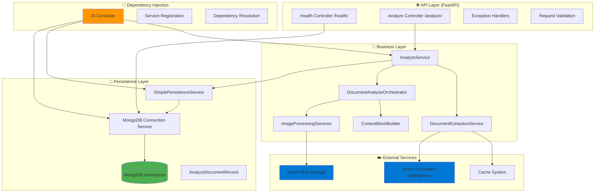
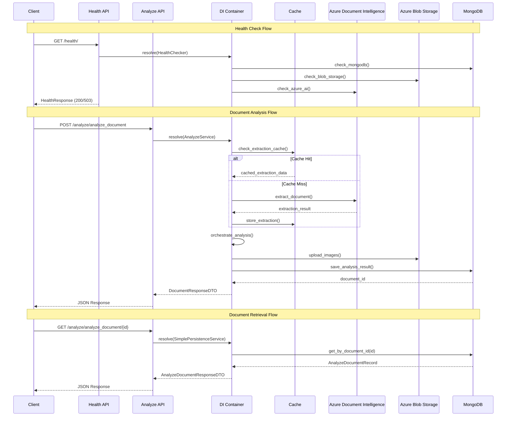
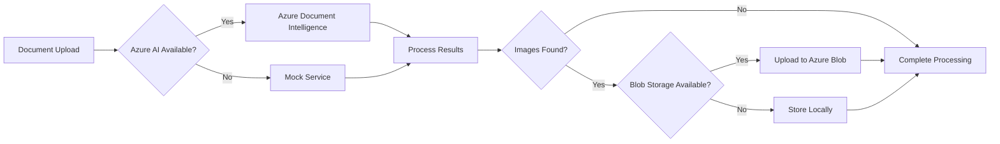

# SmartQuest - Architecture & Technology

Documentação técnica da arquitetura e tecnologias utilizadas no SmartQuest API v2.0.0.

## 🛠️ Tech Stack

| Tecnologia                      | Versão     | Propósito                    |
| ------------------------------- | ---------- | ---------------------------- |
| **Python**                      | 3.9+       | Linguagem principal          |
| **FastAPI**                     | Latest     | Framework web + API REST     |
| **MongoDB**                     | 7.0        | Banco de dados NoSQL         |
| **PyMongo/Motor**               | Latest     | Drivers MongoDB (sync/async) |
| **Pydantic**                    | Latest     | Validação e serialização     |
| **Azure Document Intelligence** | 2023-07-31 | Extração de texto/imagens    |
| **Azure Blob Storage**          | Latest     | Armazenamento de imagens     |
| **Docker**                      | Latest     | Containerização              |
| **Pytest**                      | Latest     | Framework de testes          |

## 🏗️ Arquitetura do Sistema v2.0.0

### 📊 **Diagrama de Componentes Atualizado**



### 🔄 **Fluxo de Processamento Detalhado v2.0.0**



## 🏛️ Arquitetura em Camadas v2.0.0

### 1. **🌐 API Layer**

```python
app/api/
├── controllers/
│   ├── analyze.py              # Endpoints de análise
│   └── health.py               # Health check completo
├── routers.py                  # Configuração de rotas
└── __init__.py                 # Exporta router principal
```

**Responsabilidades:**
- ✅ Validação de entrada via Pydantic
- ✅ Serialização de resposta (DTOs)
- ✅ Exception handling centralizado
- ✅ Health monitoring abrangente
- ✅ Request/Response logging estruturado

**Endpoints Principais:**
- `GET /health/` - Health check completo
- `POST /analyze/analyze_document` - Análise de documentos
- `GET /analyze/analyze_document/{id}` - Recuperação de documentos

### 2. **🧠 Business Layer**

```python
app/services/
├── core/
│   ├── analyze_service.py              # Orquestração principal
│   └── document_analysis_orchestrator.py  # Análise de documentos
├── extraction/
│   └── document_extraction_service.py  # Extração com cache
├── context/
│   └── context_block_builder.py       # Construção de contextos
├── image/
│   └── image_processing_services.py   # Processamento de imagens
├── azure/
│   └── azure_services.py              # Integrações Azure
└── mock/
    └── mock_services.py                # Serviços mock para testes
```

**Responsabilidades:**
- ✅ Lógica de negócio principal
- ✅ Orquestração de serviços via DI Container
- ✅ Processamento de documentos em pipeline
- ✅ Cache transparente de extrações
- ✅ Integração com Azure services
- ✅ Fallback para mocks quando necessário

### 3. **� Dependency Injection Layer**

```python
app/core/
├── di_container.py             # Container IoC principal
├── interfaces.py               # Contratos de serviços
└── di_config.py               # Configuração automática
```

**Características:**
- ✅ **Inversão de Controle**: Container resolve automaticamente dependências
- ✅ **Interfaces Claras**: Contratos bem definidos (IAnalyzeService, etc.)
- ✅ **Configuração Automática**: Auto-registro de serviços
- ✅ **Testabilidade**: Fácil substituição por mocks

**Exemplo de Resolução:**
```python
# Container resolve toda a árvore automaticamente
analyze_service = container.resolve(IAnalyzeService)
# ↳ AnalyzeService
#   ├── IDocumentAnalysisOrchestrator → DocumentAnalysisOrchestrator
#   ├── IImageCategorizer → ImageCategorizationService
#   ├── IContextBuilder → RefactoredContextBlockBuilder
#   └── ISimplePersistenceService → SimplePersistenceService
```

### 4. **💾 Persistence Layer**

```python
app/services/persistence/
├── simple_persistence_service.py      # Interface principal
└── infrastructure/
    ├── mongodb_connection_service.py  # Gerenciamento de conexões
    └── mongodb_service.py             # Operações diretas
```

**Responsabilidades:**
- ✅ Operações CRUD no MongoDB
- ✅ Gerenciamento de conexões assíncronas
- ✅ Models Pydantic para persistência
- ✅ Transações e rollback
- ✅ Health check de conectividade

### 5. **📊 Models & DTOs**

```python
app/models/
├── persistence/                # Models para MongoDB
│   ├── analyze_document_record.py
│   └── base_document.py
└── internal/                  # Models internos
    └── context_models.py

app/dtos/
├── responses/                 # DTOs da API
│   ├── document_response_dto.py
│   └── analyze_document_response_dto.py
└── api/                      # DTOs de entrada
```

**Separation of Concerns:**
- ✅ **Models**: Representação interna e persistência
- ✅ **DTOs**: Contratos da API (entrada/saída)
- ✅ **Conversão**: Métodos automáticos between models/DTOs

## 💾 MongoDB Persistence System v2.0.0

### 🗄️ **Collections Principais**

| Collection              | Propósito             | Modelo                      | Crítico |
| ----------------------- | --------------------- | --------------------------- | ------- |
| `analyze_documents`     | Resultados de análise | `AnalyzeDocumentRecord`     | ✅      |
| `azure_processing_data` | Métricas Azure        | `AzureProcessingDataRecord` | ❌      |
| `migrations`            | Controle de versão DB | System                      | ✅      |

### 📋 **Models Pydantic Atualizados**

```python
# Modelo principal de persistência v2.0.0
class AnalyzeDocumentRecord(BaseDocument):
    user_email: str                    # Email do usuário
    file_name: str                     # Nome do arquivo original
    response: Dict[str, Any]           # Response completo da API (DocumentResponseDTO)
    status: DocumentStatus             # PENDING, PROCESSING, COMPLETED, FAILED
    created_at: datetime               # Timestamp de criação
    updated_at: Optional[datetime]     # Timestamp de atualização
    document_id: str                   # ID único gerado para o documento
    
    @classmethod
    def create_from_request(cls, user_email: str, file_name: str, 
                          response: Dict[str, Any], status: DocumentStatus):
        """Factory method para criar registro a partir de request"""
        return cls(
            user_email=user_email,
            file_name=file_name,
            response=response,
            status=status,
            document_id=cls.generate_document_id()
        )

# Modelo de dados do Azure
class AzureProcessingDataRecord(BaseDocument):
    operation_id: str                  # ID da operação Azure
    model_id: str                      # Modelo utilizado
    api_version: str                   # Versão da API Azure
    response: Dict[str, Any]           # Response bruto Azure
    metrics: ProcessingMetrics         # Métricas de performance
    created_at: datetime               # Timestamp do processamento
```

### 🔄 **Sistema de Migrações Atualizado**

```bash
scripts/migrations/
├── 2025-10-14_001000_create_initial_collections.js
├── 2025-10-14_002000_add_enhanced_status_field.js
├── 2025-10-18_001000_remove_duplicate_collections.js
└── 2025-10-29_001000_add_document_id_field.js         # Nova migração
```

**Características:**
- ✅ Scripts versionados cronologicamente
- ✅ Verificação automática de aplicação
- ✅ Rollback support
- ✅ Registro em collection `migrations`
- ✅ **Idempotência**: Scripts podem ser executados múltiplas vezes

### 🎯 **Persistência Obrigatória**

No v2.0.0, a persistência no MongoDB é **obrigatória** para todos os documentos analisados:

```python
# Falha na persistência = falha da análise
try:
    document_id = await persistence_service.save_analysis_result(analysis_record)
    logger.info("Analysis result persisted successfully", context={"document_id": document_id})
except Exception as e:
    logger.error("Failed to persist analysis result - MongoDB required")
    raise DocumentProcessingError(f"Failed to persist analysis result: {str(e)}")
```

**Benefícios:**
- ✅ **Auditoria Completa**: Todos os documentos são rastreáveis
- ✅ **Recuperação de Dados**: Endpoint GET para busca por ID
- ✅ **Métricas**: Análise de uso e performance
- ✅ **Compliance**: Requisitos de rastreabilidade atendidos

## 🚀 Azure Integration v2.0.0

### ☁️ **Serviços Azure Utilizados**

| Serviço                        | Propósito              | Criticidade | Fallback |
| ------------------------------ | ---------------------- | ----------- | -------- |
| **Azure Document Intelligence** | Extração de texto/imagens | Médio       | Mock Service |
| **Azure Blob Storage**         | Armazenamento de imagens | Alto        | Local Storage |

### 📊 **Configuração Completa**

```python
# Azure Document Intelligence
AZURE_DOCUMENT_INTELLIGENCE_ENDPOINT=https://your-service.cognitiveservices.azure.com/
AZURE_DOCUMENT_INTELLIGENCE_KEY=your-api-key
AZURE_DOCUMENT_INTELLIGENCE_MODEL=prebuilt-layout
AZURE_DOCUMENT_INTELLIGENCE_API_VERSION=2023-07-31

# Azure Blob Storage
AZURE_BLOB_STORAGE_URL=https://your-storage.blob.core.windows.net/
AZURE_BLOB_CONTAINER_NAME=smartquest-images
AZURE_BLOB_SAS_TOKEN=your-sas-token
```

### � **Processamento com Fallbacks**



**Características:**
- ✅ **Resiliente**: Funciona mesmo com serviços indisponíveis
- ✅ **Health Check**: Monitora status de cada serviço
- ✅ **Graceful Degradation**: Mock services quando necessário
- ✅ **Cost Optimization**: Cache reduz chamadas desnecessárias

### 📈 **Métricas e Monitoramento**

```python
# Coleta automática de métricas
class ProcessingMetrics(BaseModel):
    operation_duration_ms: int
    azure_call_count: int
    cache_hit_rate: float
    success_rate: float
    error_count: int
```

## 💨 Sistema de Cache Avançado v2.0.0

### 🔧 **Cache Inteligente Multi-Layer**

```python
# Estrutura de cache key otimizada
cache_key = f"{email}_{filename}_{file_size}_{content_hash}"

# Configuração flexível
CACHE_DURATION_DAYS = 7                    # Duração padrão
CACHE_DIRECTORY = "./cache/documents"       # Diretório local
CACHE_CLEANUP_INTERVAL_HOURS = 24          # Limpeza automática
CACHE_MAX_SIZE_GB = 10                     # Limite de tamanho
```

**Features Avançadas:**
- ✅ **Cache Automático**: Response completo do Azure Document Intelligence
- ✅ **Duração Configurável**: 7 dias default, ajustável via env
- ✅ **Isolamento por Usuário**: Cache separado por email
- ✅ **Cleanup Automático**: Remoção de arquivos expirados
- ✅ **Hash de Conteúdo**: Evita cache de documentos modificados
- ✅ **Limite de Tamanho**: Controle de uso de disco

### 📊 **Cache Performance**

```python
# Métricas de cache coletadas automaticamente
class CacheMetrics:
    hit_rate: float           # Taxa de acerto do cache
    miss_rate: float          # Taxa de miss do cache
    storage_used_gb: float    # Espaço usado em GB
    cleanup_frequency: int    # Frequência de limpeza
```

## 🔌 Dependency Injection Container v2.0.0

### ⚙️ **Configuração Automática**

```python
# app/config/di_config.py - Configuração centralizada
container.register(MongoDBConnectionService, lifetime=Singleton)
container.register(ISimplePersistenceService, SimplePersistenceService, lifetime=Singleton)
container.register(IAnalyzeService, AnalyzeService, lifetime=Singleton)
container.register(IDocumentAnalysisOrchestrator, DocumentAnalysisOrchestrator, lifetime=Transient)
container.register(IImageCategorizer, ImageCategorizationService, lifetime=Singleton)
container.register(IContextBuilder, RefactoredContextBlockBuilder, lifetime=Transient)
container.register(IFigureProcessor, AzureFigureProcessor, lifetime=Singleton)
```

**Padrões de Lifetime:**
- ✅ **Singleton**: Serviços de infraestrutura (DB, Azure)
- ✅ **Transient**: Serviços de processamento (nova instância por request)
- ✅ **Scoped**: Para futura implementação de escopo de request

### 🎯 **Benefícios Arquiteturais**

- ✅ **Loose Coupling**: Componentes desacoplados via interfaces
- ✅ **Testabilidade**: Fácil substituição por mocks
- ✅ **Lifecycle Management**: Controle automático de recursos
- ✅ **Type Safety**: Validação de tipos em tempo de desenvolvimento
- ✅ **Auto-Resolution**: Resolução automática de dependências profundas

### 📝 **Exemplo de Uso**

```python
# Container resolve automaticamente toda a árvore
analyze_service = container.resolve(IAnalyzeService)

# Internamente:
# 1. Resolve IAnalyzeService → AnalyzeService
# 2. AnalyzeService precisa de IDocumentAnalysisOrchestrator
# 3. Resolve IDocumentAnalysisOrchestrator → DocumentAnalysisOrchestrator
# 4. DocumentAnalysisOrchestrator precisa de IContextBuilder, IImageCategorizer, etc.
# 5. Resolve toda a árvore recursivamente
# 6. Retorna instância completamente configurada
```
2. **Extração** → Texto, layout, imagens
3. **Parse** → Questões, metadados, context blocks
4. **Cache** → Armazenamento local (7 dias)
5. **Persist** → MongoDB automático

## 💨 Sistema de Cache

### 🔧 **Cache Inteligente**

```python
# Estrutura de cache key
cache_key = f"{email}_{filename}_{file_size}_{hash_suffix}"

# Configuração
CACHE_DURATION_DAYS = 7
CACHE_DIRECTORY = "./cache/documents"
```

**Features:**

- Cache automático de responses Azure
- Duração configurável (7 dias default)
- Isolamento por usuário
- Cleanup automático de expirados

## 🔌 Dependency Injection Container

### ⚙️ **Configuração**

```python
# Registros principais
container.register(MongoDBConnectionService, lifetime=Singleton)
container.register(ISimplePersistenceService, MongoDBPersistenceService, lifetime=Singleton)
container.register(IAnalyzeService, AnalyzeService, lifetime=Singleton)
```

**Benefícios:**

- Loose coupling entre componentes
- Testabilidade (mock injection)
- Lifecycle management
- Type safety

## 🛡️ Exception Handling Profissional

### 🎯 **Hierarquia de Exceções**

```python
SmartQuestException (Base)
├── ValidationException (422)
├── DocumentProcessingError (500)
├── PersistenceError (500)
└── AzureServiceError (502)
```

### 🎭 **Decorator Pattern**

```python
@handle_exceptions("document_analysis")
async def analyze_document(...):
    # Business logic limpo
    return await process_document()
```

**Features:**

- Logging estruturado automático
- HTTP status codes apropriados
- Request context preservation
- Performance monitoring

## 📊 Monitoring & Health Checks

### ❤️ **Endpoints de Saúde**

| Endpoint           | Propósito             |
| ------------------ | --------------------- |
| `/health`          | Status geral da API   |
| `/health/database` | Conectividade MongoDB |

### 📈 **Métricas Coletadas**

```json
{
  "api_status": "healthy",
  "mongodb": {
    "connection_status": "connected",
    "collections": ["analyze_documents", "azure_processing_data"],
    "sample_document_exists": true
  },
  "azure_integration": "configured",
  "timestamp": "2025-10-20T15:30:00Z"
}
```

## 🔧 Configuração de Ambiente

### 📋 **Variáveis Principais**

```bash
# Azure (obrigatório)
AZURE_DOCUMENT_INTELLIGENCE_ENDPOINT=
AZURE_DOCUMENT_INTELLIGENCE_KEY=

# MongoDB (obrigatório)
MONGODB_URI=mongodb://localhost:27017
MONGODB_DATABASE=smartquest

# Cache
CACHE_DURATION_DAYS=7

# App
DEBUG=true
LOG_LEVEL=INFO
```

### 🐳 **Docker Configuration**

```yaml
# docker-compose.yml (simplificado)
services:
  smartquest-api:
    build: .
    ports: ["8000:8000"]
    depends_on: [mongodb]

  mongodb:
    image: mongo:7.0
    ports: ["27017:27017"]
    volumes: [mongodb_data:/data/db]
```

## 🎯 Padrões Arquiteturais

### 🏗️ **SOLID Principles**

- **S**ingle Responsibility: Cada classe tem propósito único
- **O**pen/Closed: Extensível via interfaces
- **L**iskov Substitution: Implementações intercambiáveis
- **I**nterface Segregation: Interfaces específicas
- **D**ependency Inversion: DI Container gerencia dependências

### 🧹 **Clean Architecture**

- **Separation of Concerns**: Camadas bem definidas
- **Dependency Rule**: Dependências apontam para dentro
- **Testability**: Business logic isolada de infraestrutura
- **Framework Independence**: Core independente de FastAPI/MongoDB

---

**🏗️ Arquitetura SmartQuest** | **v2.0-dev** | **Última atualização: Outubro 2025**
