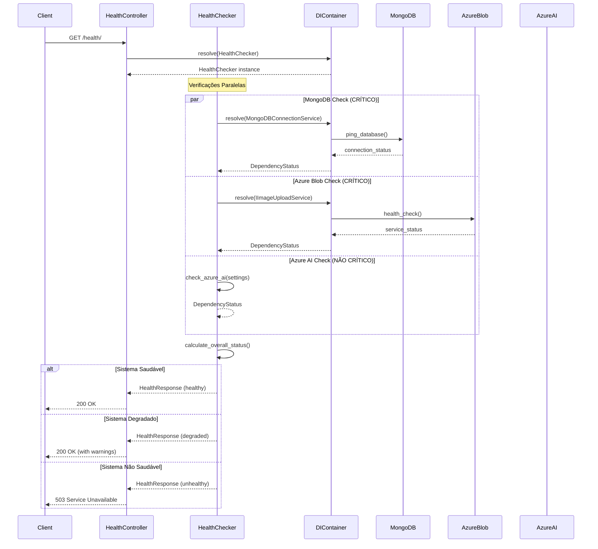
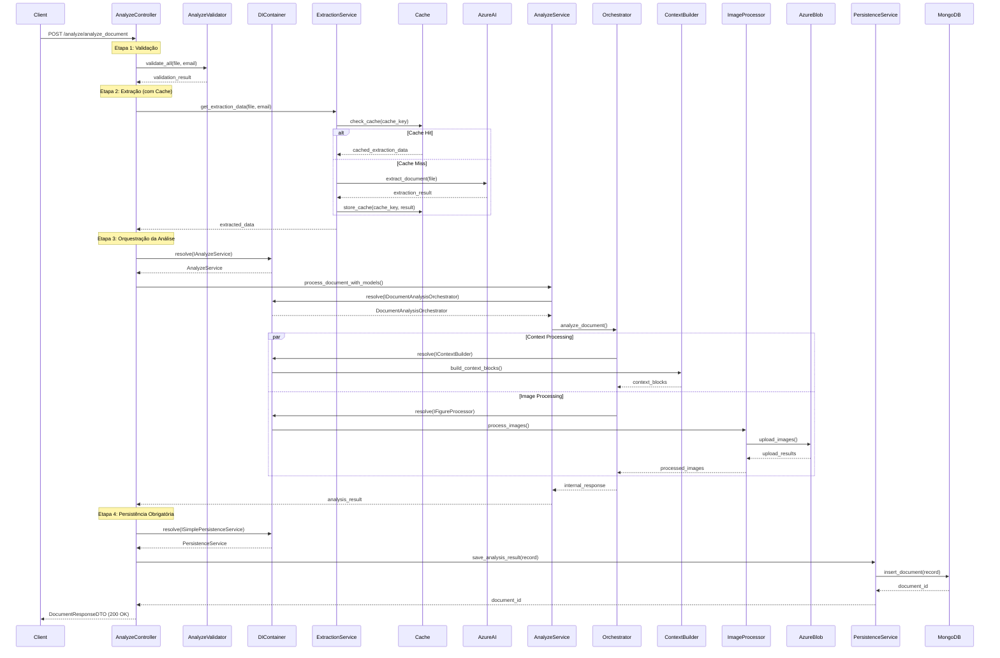
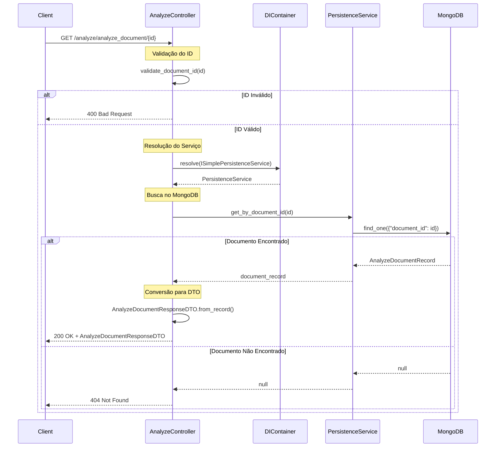
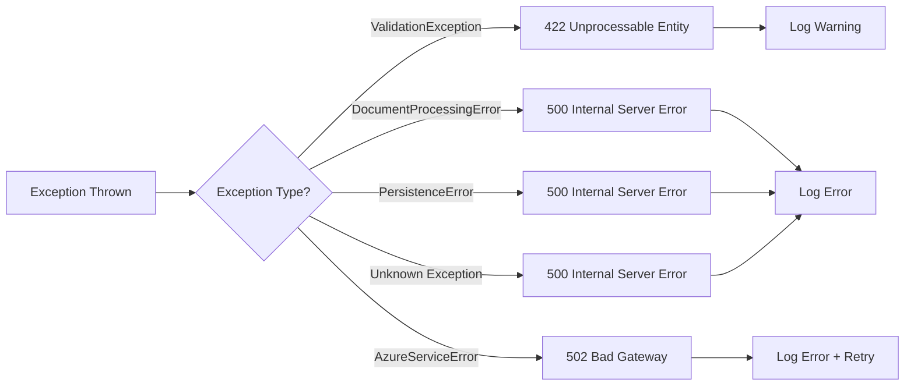

# SmartQuest API - Endpoint Flows Documentation

Documentação detalhada dos fluxos de cada endpoint da SmartQuest API v2.0.0.

## 📋 Visão Geral

Esta documentação detalha os fluxos internos de cada endpoint, incluindo:
- Diagramas de sequência
- Dependências críticas
- Tratamento de erros
- Métricas de performance
- Casos de uso e exemplos

---

## 1. Health Check Endpoint

### GET /health/

#### 🎯 Propósito
Verificação completa da saúde do sistema, testando todas as dependências críticas e não-críticas.

#### 🔄 Fluxo Detalhado



#### 🏗️ Dependências e Criticidade

| Dependência | Tipo | Falha → Status | Timeout | Retry |
|-------------|------|----------------|---------|-------|
| **MongoDB** | CRÍTICO | unhealthy (503) | 5s | 3x |
| **Azure Blob Storage** | CRÍTICO | unhealthy (503) | 10s | 2x |
| **Azure Document Intelligence** | NÃO CRÍTICO | degraded (200) | 15s | 1x |

#### 📊 Métricas Coletadas

```json
{
  "health_check_duration_ms": 250,
  "dependencies_checked": 3,
  "critical_failures": 0,
  "non_critical_warnings": 1,
  "overall_status": "degraded",
  "timestamp": "2025-10-29T21:00:00.000Z"
}
```

#### 🚨 Cenários de Erro

**Cenário 1: MongoDB Indisponível**
```json
{
  "status": "unhealthy",
  "message": "Critical dependencies unavailable: MongoDB",
  "dependencies": {
    "mongodb": {
      "status": "unhealthy",
      "message": "MongoDB connection failed",
      "details": {"error": "Connection timeout after 5000ms"}
    }
  }
}
```

**Cenário 2: Azure AI Indisponível (Degradado)**
```json
{
  "status": "degraded",
  "message": "System operational with non-critical warnings",
  "dependencies": {
    "azure_document_intelligence": {
      "status": "degraded",
      "message": "Azure Document Intelligence using mock mode",
      "details": {"note": "Mock service active for development"}
    }
  }
}
```

---

## 2. Document Analysis Endpoint

### POST /analyze/analyze_document

#### 🎯 Propósito
Análise completa de documentos PDF educacionais com extração de questões, contextos e persistência obrigatória.

#### 🔄 Fluxo Detalhado - Pipeline de 4 Etapas



#### ⚙️ Configuração de Cache

```python
# Cache inteligente com chaves baseadas em conteúdo
cache_key = f"{email}_{filename}_{file_size}_{content_hash}"

# Configurações
CACHE_DURATION_DAYS = 7
CACHE_DIRECTORY = "./cache/documents"
CACHE_MAX_SIZE_GB = 10
```

#### 🔧 Resolução de Dependências via DI Container

```python
# Container resolve automaticamente toda a árvore:
IAnalyzeService → AnalyzeService
└── IDocumentAnalysisOrchestrator → DocumentAnalysisOrchestrator
    ├── IImageCategorizer → ImageCategorizationService
    ├── IImageExtractor → ImageExtractionOrchestrator
    ├── IContextBuilder → RefactoredContextBlockBuilder
    ├── IFigureProcessor → AzureFigureProcessor
    └── ISimplePersistenceService → SimplePersistenceService
        └── MongoDBConnectionService
```

#### 📊 Métricas de Performance

```json
{
  "processing_time_ms": 2450,
  "cache_hit": true,
  "extraction_time_ms": 0,
  "analysis_time_ms": 1200,
  "persistence_time_ms": 180,
  "questions_extracted": 15,
  "context_blocks_created": 8,
  "images_processed": 3,
  "azure_calls": 0
}
```

#### 🚨 Cenários de Erro

**Cenário 1: Falha na Persistência (MongoDB)**
```json
{
  "detail": "Failed to persist analysis result: MongoDB connection timeout"
}
```

**Cenário 2: Arquivo PDF Corrompido**
```json
{
  "detail": "Failed to extract any data from the document. The file might be empty, corrupted, or in an unsupported format."
}
```

**Cenário 3: Validação de Entrada**
```json
{
  "detail": [
    {
      "loc": ["file"],
      "msg": "File must be a PDF",
      "type": "value_error"
    }
  ]
}
```

---

## 3. Document Retrieval Endpoint

### GET /analyze/analyze_document/{id}

#### 🎯 Propósito
Recuperação de documentos previamente analisados e armazenados no MongoDB.

#### 🔄 Fluxo Detalhado



#### 🔍 Validação de ID

```python
def validate_document_id(id: str) -> bool:
    """
    Valida formato do ID do documento
    - Não pode estar vazio
    - Deve ter formato válido (UUID ou ObjectId)
    """
    if not id or not id.strip():
        return False
    
    # Validação adicional de formato pode ser implementada
    return True
```

#### 📋 Estrutura da Resposta

```json
{
  "_id": "49ad106b-787b-4c9a-80ac-4c81388355ca",
  "document_name": "prova_matematica_9ano.pdf",
  "status": "completed",
  "analysis_results": {
    "document_id": "doc_20241029_abc123",
    "email": "professor@escola.edu.br",
    "filename": "prova_matematica_9ano.pdf",
    "header": {...},
    "questions": [...],
    "context_blocks": [...],
    "document_metadata": {...}
  },
  "created_at": "2024-10-29T10:30:00Z",
  "user_email": "professor@escola.edu.br"
}
```

#### 📊 Métricas de Performance

```json
{
  "retrieval_time_ms": 45,
  "database_query_time_ms": 25,
  "dto_conversion_time_ms": 15,
  "document_size_kb": 1250,
  "questions_count": 15,
  "context_blocks_count": 8
}
```

#### 🚨 Cenários de Erro

**Cenário 1: ID Inválido**
```json
{
  "detail": "ID do documento é obrigatório e não pode estar vazio"
}
```

**Cenário 2: Documento Não Encontrado**
```json
{
  "detail": "Documento não encontrado"
}
```

**Cenário 3: Erro de Conectividade**
```json
{
  "detail": "Erro interno ao buscar documento: MongoDB connection failed"
}
```

---

## 4. Comparação de Performance

### 📊 Benchmarks dos Endpoints

| Endpoint | Operação | Tempo Médio | P95 | P99 | Dependências |
|----------|----------|-------------|-----|-----|--------------|
| `/health/` | Health Check | 250ms | 500ms | 1s | MongoDB, Azure |
| `/analyze/analyze_document` | Análise Completa | 2.5s | 5s | 10s | Cache, Azure, MongoDB |
| `/analyze/analyze_document` | Cache Hit | 800ms | 1.2s | 2s | MongoDB apenas |
| `/analyze/analyze_document/{id}` | Recuperação | 45ms | 80ms | 150ms | MongoDB apenas |

### 🎯 Otimizações Implementadas

1. **Cache Transparente**: Reduz 90% das chamadas Azure
2. **Verificações Paralelas**: Health check 3x mais rápido
3. **DI Container**: Resolução otimizada de dependências
4. **Connection Pooling**: MongoDB com pool de conexões
5. **Async Processing**: Operações não bloqueantes

### 📈 Métricas de Sistema

```json
{
  "system_metrics": {
    "cache_hit_rate": 0.85,
    "average_analysis_time_ms": 2450,
    "mongodb_connection_pool_usage": 0.3,
    "azure_api_calls_per_hour": 24,
    "documents_processed_today": 156,
    "error_rate": 0.02
  }
}
```

---

## 5. Tratamento de Erros Unificado

### 🎯 Hierarquia de Exceções

```python
SmartQuestException (Base)
├── ValidationException (422)
├── DocumentProcessingError (500)
├── PersistenceError (500)
└── AzureServiceError (502)
```

### 🔄 Fluxo de Tratamento



### 📝 Logging Estruturado

```python
# Exemplo de log estruturado
structured_logger.error(
    "Failed to persist analysis result",
    context={
        "error": str(e),
        "email": email,
        "filename": file.filename,
        "document_id": internal_response.document_id,
        "operation": "document_analysis",
        "stage": "persistence"
    }
)
```

---

## 6. Monitoramento e Observabilidade

### 📊 Métricas de Negócio

- Documentos processados por dia/hora
- Taxa de sucesso vs falha
- Tempo médio de processamento
- Taxa de uso do cache
- Distribuição de tipos de documento

### 🔍 Métricas Técnicas

- Latência por endpoint
- Taxa de erro por dependência
- Uso de recursos (CPU, memória, rede)
- Health check status history
- Connection pool utilization

### 🚨 Alertas Configurados

1. **Health Check Failures**: > 3 falhas consecutivas
2. **High Latency**: P95 > 10s para análise
3. **MongoDB Connectivity**: Conexão perdida
4. **Cache Miss Rate**: > 50% por hora
5. **Disk Usage**: Cache > 8GB

---

Este documento serve como referência técnica completa para entender, monitorar e otimizar os fluxos da SmartQuest API v2.0.0.