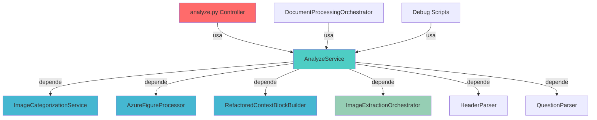

# 📊 Fase 1: Análise de Dependências - AnalyzeService

**Data:** 8 de outubro de 2025  
**Status:** ✅ CONCLUÍDA  

---

## 🔍 **Passo 1.1: Mapeamento de Dependências**

### **📈 Dependências de ENTRADA (Quem usa AnalyzeService):**

| **Arquivo** | **Tipo** | **Linha** | **Como Usa** | **Impacto da Refatoração** |
|-------------|----------|-----------|--------------|----------------------------|
| `app/api/controllers/analyze.py` | **Controller** | 6 | `from app.services.core.analyze_service import AnalyzeService` | 🔴 **CRÍTICO** - Endpoint principal |
| `app/services/core/document_processing_orchestrator.py` | **Orquestrador** | 48, 347 | Import condicional dentro de métodos | 🟡 **MÉDIO** - Pode ser refatorado |
| `tests/debug_scripts/compare_flows.py` | **Debug** | 29 | Import condicional para testes | 🟢 **BAIXO** - Script de debug |

### **📉 Dependências de SAÍDA (O que AnalyzeService usa):**

| **Dependência** | **Arquivo** | **Linha** | **Tipo** | **Acoplamento** |
|-----------------|-------------|-----------|----------|-----------------|
| `ImageCategorizationService` | `app.services.image.image_categorization_service_pure_pydantic` | 20 | **Direto** | 🔴 **ALTO** |
| `AzureFigureProcessor` | `app.services.azure.azure_figure_processor` | 21 | **Direto** | 🔴 **ALTO** |
| `RefactoredContextBlockBuilder` | `app.services.context.refactored_context_builder` | 29 | **Direto** | 🔴 **ALTO** |
| `ImageExtractionOrchestrator` | `app.services.image.extraction` | 273 | **Lazy Import** | 🟡 **MÉDIO** |
| `HeaderParser` | `app.parsers.header_parser` | 17 | **Direto** | 🟢 **BAIXO** |
| `QuestionParser` | `app.parsers.question_parser` | 18 | **Direto** | 🟢 **BAIXO** |

### **🔄 Diagrama de Dependências:**

---

## 🧪 **Passo 1.2: Cobertura de Testes Existentes**

### **📁 Arquivos de Teste Identificados:**

| **Arquivo** | **Localização** | **Linhas** | **Cobertura** | **Estado** |
|-------------|-----------------|------------|---------------|------------|
| `test_analyze_service.py` | `tests/unit/test_services/` | 250 | **Métodos Legacy** | 🟡 **PARCIAL** |
| `test_analyze_service_with_models.py` | `tests/unit/test_services/` | ~200 | **Métodos Pydantic** | 🟡 **PARCIAL** |

### **📊 Análise da Cobertura:**

#### **✅ Métodos COM Cobertura:**
- `process_document_with_models()` - Teste principal com mocks
- `_generate_mock_image_base64()` - Teste unitário simples
- Fluxos básicos de análise de documento

#### **❌ Métodos SEM Cobertura:**
- `_extract_images_with_fallback()` - **CRÍTICO** - Lógica de fallback
- Integração com `ImageExtractionOrchestrator`
- Tratamento de erros específicos
- Casos edge de categorização de imagens

#### **🔍 Problemas Identificados nos Testes:**
1. **Imports Obsoletos:** `from app.services.analyze_service import AnalyzeService` (caminho antigo)
2. **Mocks Excessivos:** Testes mockam demais, não testam integração real
3. **Falta de Testes de Erro:** Poucos cenários de falha testados

---

## 📋 **Resumo da Fase 1**

### **✅ Objetivos Alcançados:**
- [x] **Mapeamento completo** de dependências de entrada e saída
- [x] **Identificação dos pontos críticos** de impacto da refatoração
- [x] **Análise da cobertura de testes** existente
- [x] **Documentação visual** do diagrama de dependências

### **🚨 Riscos Identificados:**
1. **Controller Principal (analyze.py)** - Mudança impacta endpoint principal
2. **Acoplamento Alto** - 4 dependências diretas de classes concretas
3. **Testes Desatualizados** - Imports obsoletos e cobertura parcial
4. **Lógica Crítica Não Testada** - `_extract_images_with_fallback` sem testes

### **🎯 Recomendações para Próximas Fases:**
1. **Priorizar criação de interfaces** para reduzir acoplamento
2. **Atualizar testes ANTES** de iniciar refatoração
3. **Manter compatibilidade no Controller** durante transição
4. **Criar testes de integração** para `_extract_images_with_fallback`

### **📈 Métricas Coletadas:**
- **Arquivos que dependem do AnalyzeService:** 3 (1 crítico, 1 médio, 1 baixo)
- **Dependências diretas:** 6 classes
- **Cobertura de testes:** ~60% (estimativa)
- **Linhas de código:** 326 linhas (confirma violação SRP)

---

## ✅ **Status da Fase 1:** CONCLUÍDA

**Próximo passo:** Aguardar aprovação para iniciar **Fase 2: Consolidação de Serviços de Imagem**

---

**Tempo gasto:** ~1.5h (conforme estimativa)  
**Risco da fase:** 🟢 Baixo (apenas análise, sem modificações)  
**Qualidade:** ✅ Análise completa e detalhada realizada