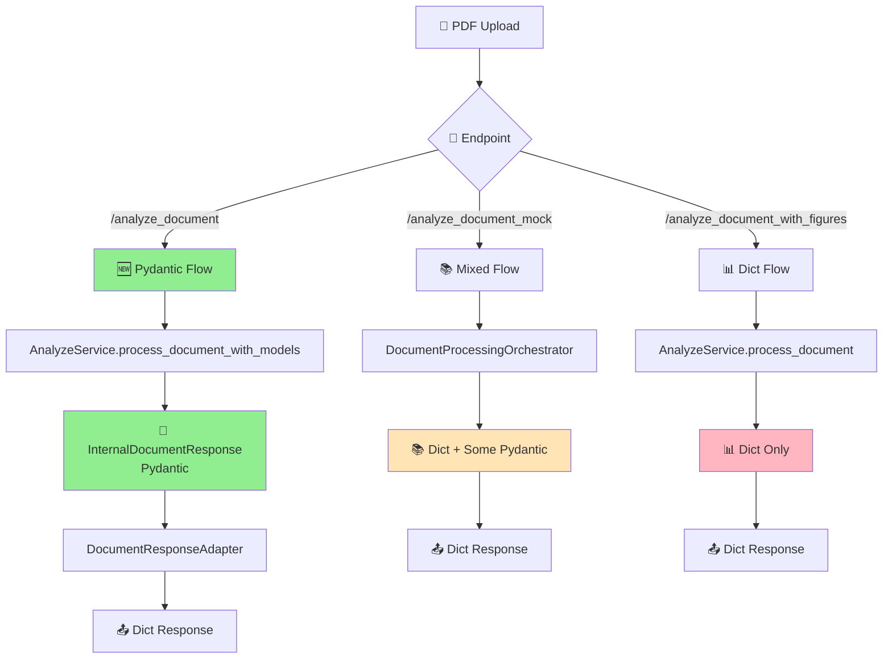

# 📋 Análise Completa: Pydantic vs Dict no SmartQuest

## 🎯 O Que São Pydantic e Dict?

### 🧸 Explicação para Leigos (como se você tivesse 5 anos)

**Imagine que você tem uma caixa de brinquedos:**

1. **Dict (Dicionário)** = Uma caixa comum sem regras
   - Você pode colocar qualquer coisa dentro
   - Não tem etiquetas fixas
   - Não verifica se os brinquedos estão quebrados
   - É rápido de usar, mas pode dar confusão

2. **Pydantic** = Uma caixa organizada com etiquetas e regras
   - Cada compartimento tem uma etiqueta específica
   - Só aceita os brinquedos certos em cada lugar
   - Verifica se tudo está em ordem antes de guardar
   - É mais trabalho no início, mas muito mais organizado

## 🗺️ Mapa do Sistema: Onde Cada Formato É Usado

### 📊 Visão Geral dos Fluxos



## 🔍 Análise Detalhada por Componente

### 1. 🆕 ENDPOINT: `/analyze_document` - **PYDANTIC PRINCIPAL**

**Status**: ✅ **MIGRADO PARA PYDANTIC**

```python
# Fluxo Pydantic Completo
internal_response = await AnalyzeService.process_document_with_models(
    file=file, 
    email=email, 
    use_refactored=True
)
# ↓ RESULTADO: InternalDocumentResponse (Pydantic)

api_response = DocumentResponseAdapter.to_api_response(internal_response)
# ↓ CONVERSÃO: Pydantic → Dict para API
```

**Modelos Pydantic Usados:**
- `InternalDocumentResponse` - Modelo principal
- `InternalDocumentMetadata` - Metadados do documento
- `InternalImageData` - Dados de imagem (parcial)

**Pontos de Conversão:**
- **ENTRADA**: Dict → Pydantic (`from_legacy_header()`)
- **SAÍDA**: Pydantic → Dict (`DocumentResponseAdapter`)

---

### 2. 📚 ENDPOINT: `/analyze_document_mock` - **MISTO**

**Status**: ⚠️ **TRANSIÇÃO (Dict + Alguns Pydantic)**

```python
# Fluxo Híbrido
extracted_data = await DocumentProcessingOrchestrator.process_document_from_saved_azure_response()
# ↓ RESULTADO: Dict (formato legado)

# Alguns helpers usam Pydantic internamente, mas retornam Dict
```

**O Que É Pydantic:**
- Alguns helpers de conversão internos
- Validações pontuais

**O Que É Dict:**
- Response final
- Estrutura principal de dados
- Processamento intermediário

---

### 3. 📊 ENDPOINT: `/analyze_document_with_figures` - **DICT COMPLETO**

**Status**: ❌ **NÃO MIGRADO (Dict Only)**

```python
# Fluxo Dict Tradicional
extracted_data = await AnalyzeService.process_document(file, email, use_refactored)
# ↓ RESULTADO: Dict[str, Any]

return extracted_data  # Dict direto
```

**Características:**
- Tudo é `Dict[str, Any]`
- Sem validação de tipos
- Formato legado mantido

---

## 🏗️ Arquitetura de Modelos

### 📁 **Modelos Internos (Pydantic)** - `app/models/internal/`

```
📦 app/models/internal/
├── 📄 document_models.py
│   ├── InternalDocumentMetadata(BaseModel) ✅
│   └── InternalDocumentResponse(BaseModel) ✅
├── 📄 context_models.py
│   ├── InternalContextContent(BaseModel) ✅
│   └── InternalContextBlock(BaseModel) ✅
├── 📄 question_models.py
│   ├── InternalQuestion(BaseModel) ✅
│   └── InternalAnswerOption(BaseModel) ✅
└── 📄 image_models.py
    ├── InternalImageData(BaseModel) ✅
    └── ImagePosition(BaseModel) ✅
```

### 📁 **DTOs de API (Pydantic)** - `app/dtos/`

```
📦 app/dtos/
├── 📁 api/
│   ├── document_dtos.py - DocumentResponseDTO(BaseModel) ✅
│   ├── context_dtos.py - ContextDTO(BaseModel) ✅
│   └── question_dtos.py - QuestionDTO(BaseModel) ✅
└── 📁 responses/
    └── document_dtos.py - DocumentResponseDTO(BaseModel) ✅
```

### 🔄 **Adaptadores (Pydantic → Dict)**

```
📦 app/adapters/
└── 📄 document_response_adapter.py
    └── DocumentResponseAdapter
        ├── to_api_response() → Dict[str, Any] ⚠️
        ├── to_full_response() → Dict[str, Any] ⚠️
        └── to_minimal_response() → Dict[str, Any] ⚠️
```

---

## 🎯 Serviços: Onde Cada Formato É Usado

### ✅ **Serviços Que Usam Pydantic**

| Serviço | Uso de Pydantic | Status |
|---------|----------------|--------|
| `AnalyzeService.process_document_with_models()` | **Full Pydantic** | ✅ Migrado |
| `InternalDocumentMetadata.from_legacy_header()` | **Converter Dict → Pydantic** | ✅ Ativo |
| `DocumentResponseAdapter` | **Converter Pydantic → Dict** | ✅ Ativo |

### ⚠️ **Serviços Mistos (Dict + Pydantic)**

| Serviço | Dict Usage | Pydantic Usage | Status |
|---------|------------|----------------|--------|
| `DocumentProcessingOrchestrator` | Response final | Helpers internos | 🔄 Transição |
| `AzureResponseService` | Dados salvos | Validações | 🔄 Transição |
| `MockDocumentService` | Tudo | Nenhum | ❌ Não migrado |

### ❌ **Serviços Que Só Usam Dict**

| Serviço | Motivo | Status |
|---------|--------|--------|
| `AnalyzeService.process_document()` | Método legado | ❌ Legacy |
| `RefactoredContextBuilder` | Performance | ❌ Não migrado |
| `QuestionParser` | Compatibilidade | ❌ Não migrado |
| `HeaderParser` | Legacy format | ❌ Não migrado |

---

## 🚧 Problemas Atuais

### ❗ **1. Inconsistência de Formatos**

```python
# PROBLEMA: Mesmo service, formatos diferentes
AnalyzeService.process_document()           # → Dict[str, Any]
AnalyzeService.process_document_with_models() # → InternalDocumentResponse

# CONFUSÃO: Endpoints usam formatos diferentes
/analyze_document          # Pydantic → Dict
/analyze_document_mock     # Dict direto
/analyze_document_with_figures # Dict direto
```

### ❗ **2. Conversões Desnecessárias**

```python
# INEFICIÊNCIA: Pydantic → Dict → Pydantic → Dict
azure_data (Dict) 
  → InternalDocumentMetadata.from_legacy_header() (Pydantic)
  → InternalDocumentResponse (Pydantic)
  → DocumentResponseAdapter.to_api_response() (Dict)
```

### ❗ **3. Duplicação de Lógica**

- **Parsers**: HeaderParser (Dict) vs InternalDocumentMetadata (Pydantic)
- **Builders**: Context builders em Dict vs DTOs em Pydantic
- **Validators**: Validação manual vs Pydantic automático

---

## 🎯 Estado da Migração

### ✅ **O Que Já É Pydantic (Migrado)**

| Componente | Status | Cobertura |
|------------|--------|-----------|
| **Modelos Internos** | ✅ Completo | 100% |
| **DTOs de API** | ✅ Completo | 100% |
| **Endpoint Principal** | ✅ Migrado | `/analyze_document` |
| **Adaptadores** | ✅ Funcionando | Conversão automática |

### 🔄 **O Que Está em Transição**

| Componente | Status | Próximos Passos |
|------------|--------|-----------------|
| **Mock Endpoint** | ⚠️ Misto | Migrar orchestrator |
| **Azure Services** | ⚠️ Misto | Usar Pydantic responses |
| **Image Extractors** | ⚠️ Misto | Migrar para InternalImageData |

### ❌ **O Que Ainda É Dict (Pendente)**

| Componente | Impacto | Prioridade |
|------------|---------|------------|
| **Figures Endpoint** | Alto | 🔴 Alta |
| **Context Builders** | Médio | 🟡 Média |
| **Question Parsers** | Alto | 🔴 Alta |
| **Image Processing** | Médio | 🟡 Média |

---

## 🚀 Recomendações

### 🎯 **Fase 1: Unificar Endpoints (Urgente)**

1. **Migrar `/analyze_document_with_figures`**
   ```python
   # MUDAR DE:
   extracted_data = await AnalyzeService.process_document()  # Dict
   
   # PARA:
   internal_response = await AnalyzeService.process_document_with_models()  # Pydantic
   api_response = DocumentResponseAdapter.to_api_response(internal_response)
   ```

2. **Migrar `/analyze_document_mock`**
   - Fazer `DocumentProcessingOrchestrator` retornar Pydantic
   - Usar `InternalDocumentResponse` como padrão

### 🎯 **Fase 2: Eliminar Conversões (Performance)**

1. **Integrar Parsers com Pydantic**
   ```python
   # ELIMINAR conversão dupla:
   legacy_header = HeaderParser.parse(text)  # Dict
   metadata = InternalDocumentMetadata.from_legacy_header(legacy_header)  # Pydantic
   
   # CRIAR direto:
   metadata = HeaderParser.parse_to_pydantic(text)  # Pydantic direto
   ```

2. **Migrar Context Builders**
   - Usar `InternalContextBlock` em vez de Dict
   - Eliminar conversões nos builders

### 🎯 **Fase 3: Padronizar Tudo (Qualidade)**

1. **Question Parser → Pydantic**
2. **Image Extractors → InternalImageData**
3. **Eliminar métodos Dict legados**

---

## 📊 Métricas de Progresso

### 🎯 **Status Atual (Setembro 2025)**

| Categoria | Pydantic | Dict | Misto | Total |
|-----------|----------|------|-------|--------|
| **Endpoints** | 1 | 2 | 0 | 3 |
| **Services** | 3 | 8 | 4 | 15 |
| **Models** | 8 | 0 | 0 | 8 |
| **DTOs** | 6 | 0 | 0 | 6 |

**Progresso Geral: 53% Migrado para Pydantic**

### 🎯 **Meta (Outubro 2025)**

| Categoria | Pydantic | Dict | Misto |
|-----------|----------|------|-------|
| **Endpoints** | 3 | 0 | 0 |
| **Services** | 12 | 1 | 2 |
| **Models** | 8 | 0 | 0 |
| **DTOs** | 6 | 0 | 0 |

**Meta: 90% Migrado para Pydantic**

---

## 🔧 Ferramentas de Desenvolvimento

### 🎯 **Como Identificar Uso de Dict vs Pydantic**

```bash
# Procurar por Dict usage
grep -r "Dict\[str.*Any\]" app/

# Procurar por BaseModel (Pydantic)
grep -r "BaseModel" app/

# Procurar por conversões
grep -r "\.dict()\|\.model_dump()" app/
```

### 🎯 **Como Testar Conversões**

```python
# Testar se model é Pydantic
isinstance(obj, BaseModel)

# Testar se é Dict
isinstance(obj, dict)

# Converter Pydantic → Dict
pydantic_obj.model_dump()

# Converter Dict → Pydantic
PydanticModel(**dict_data)
```

---

## 🎯 Conclusão

**O sistema está em transição ativa de Dict para Pydantic:**

- ✅ **Modelo Principal Migrado**: `/analyze_document` usa Pydantic completo
- ⚠️ **Inconsistência Atual**: 3 endpoints com formatos diferentes
- 🎯 **Objetivo**: Unificar tudo em Pydantic para melhor qualidade e manutenção

**Próximos Passos Críticos:**
1. Migrar `/analyze_document_with_figures` (alta prioridade)
2. Padronizar mock endpoint
3. Eliminar conversões desnecessárias

**Benefícios da Migração Completa:**
- 🛡️ Validação automática de tipos
- 📚 Documentação automática (OpenAPI)
- 🐛 Menos bugs de runtime
- 🚀 Melhor performance (menos conversões)
- 🧹 Código mais limpo e legível
