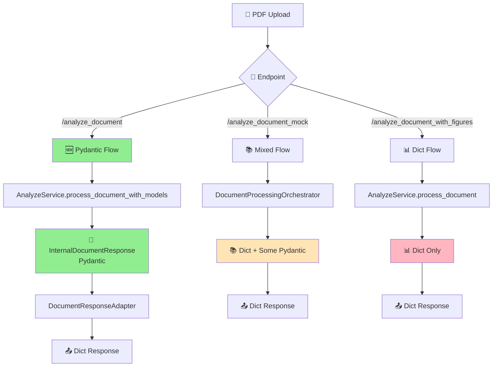

# 📋 Análise Completa: Pydantic vs Dict no SmartQuest

## 🎯 O Que São Pydantic e Dict?

### 🧸 Explicação para Leigos (como se você tivesse 5 anos)

**Imagine que você tem uma caixa de brinquedos:**

1. **Dict (Dicionário)** = Uma caixa comum sem regras
   - Você pode colocar qualquer coisa dentro
   - Não tem etiquetas fixas
   - Não verifica se os brinquedos estão quebrados
   - É rápido de usar, mas pode dar confusão

2. **Pydantic** = Uma caixa organizada com etiquetas e regras
   - Cada compartimento tem uma etiqueta específica
   - Só aceita os brinquedos certos em cada lugar
   - Verifica se tudo está em ordem antes de guardar
   - É mais trabalho no início, mas muito mais organizado

## 🗺️ Mapa do Sistema: Onde Cada Formato É Usado

### 📊 Visão Geral dos Fluxos



## 🔍 Análise Detalhada por Componente

### 1. 🆕 ENDPOINT: `/analyze_document` - **HÍBRIDO PYDANTIC-DICT**

**Status**: ⚠️ **PARCIALMENTE MIGRADO** (Estrutura Pydantic + Pipeline Dict)

```python
# Fluxo HÍBRIDO com dependências Dict
internal_response = await AnalyzeService.process_document_with_models(
    file=file, 
    email=email, 
    use_refactored=True
)
# ↓ INTERNAMENTE: HeaderParser.parse() → Dict ❌
# ↓ CONVERSÃO 1: Dict → Pydantic via from_legacy_header()
# ↓ INTERNAMENTE: QuestionParser.extract() → Dict ❌  
# ↓ RESULTADO: InternalDocumentResponse (Pydantic com campos Dict)

api_response = DocumentResponseAdapter.to_api_response(internal_response)
# ↓ CONVERSÃO 2: Pydantic → Dict (desnecessária) ❌
```

**❌ Dependências Dict Críticas:**
- `HeaderParser.parse()` → `Dict[str, Any]` (obriga conversão)
- `QuestionParser.extract()` → `Dict[str, Any]` (obriga conversão)
- `InternalDocumentResponse.questions` → `List[Dict[str, Any]]` (não tipado!)
- `InternalDocumentResponse.context_blocks` → `List[Dict[str, Any]]` (não tipado!)

**✅ Partes Pydantic:**
- `InternalDocumentResponse` - Estrutura principal
- `InternalDocumentMetadata` - Metadados do documento
- `InternalImageData` - Dados de imagem (não usado ainda)

**🔄 Conversões Desnecessárias:**
1. **HeaderParser**: `str` → `Dict` → `InternalDocumentMetadata` (deveria ser direto)
2. **QuestionParser**: `str` → `Dict` → permanece `Dict` (deveria ser `InternalQuestion`)
3. **API Response**: `InternalDocumentResponse` → `Dict` → JSON (deveria ser direto)

---

### 2. 📚 ENDPOINT: `/analyze_document_mock` - **MISTO**

**Status**: ⚠️ **TRANSIÇÃO (Dict + Alguns Pydantic)**

```python
# Fluxo Híbrido
extracted_data = await DocumentProcessingOrchestrator.process_document_from_saved_azure_response()
# ↓ RESULTADO: Dict (formato legado)

# Alguns helpers usam Pydantic internamente, mas retornam Dict
```

**O Que É Pydantic:**
- Alguns helpers de conversão internos
- Validações pontuais

**O Que É Dict:**
- Response final
- Estrutura principal de dados
- Processamento intermediário

---

### 3. 📊 ENDPOINT: `/analyze_document_with_figures` - **DICT COMPLETO**

**Status**: ❌ **NÃO MIGRADO (Dict Only)**

```python
# Fluxo Dict Tradicional
extracted_data = await AnalyzeService.process_document(file, email, use_refactored)
# ↓ RESULTADO: Dict[str, Any]

return extracted_data  # Dict direto
```

**Características:**
- Tudo é `Dict[str, Any]`
- Sem validação de tipos
- Formato legado mantido

---

## 🏗️ Arquitetura de Modelos

### 📁 **Modelos Internos (Pydantic)** - `app/models/internal/`

```
📦 app/models/internal/
├── 📄 document_models.py
│   ├── InternalDocumentMetadata(BaseModel) ✅
│   └── InternalDocumentResponse(BaseModel) ✅
├── 📄 context_models.py
│   ├── InternalContextContent(BaseModel) ✅
│   └── InternalContextBlock(BaseModel) ✅
├── 📄 question_models.py
│   ├── InternalQuestion(BaseModel) ✅
│   └── InternalAnswerOption(BaseModel) ✅
└── 📄 image_models.py
    ├── InternalImageData(BaseModel) ✅
    └── ImagePosition(BaseModel) ✅
```

### 📁 **DTOs de API (Pydantic)** - `app/dtos/`

```
📦 app/dtos/
├── 📁 api/
│   ├── document_dtos.py - DocumentResponseDTO(BaseModel) ✅
│   ├── context_dtos.py - ContextDTO(BaseModel) ✅
│   └── question_dtos.py - QuestionDTO(BaseModel) ✅
└── 📁 responses/
    └── document_dtos.py - DocumentResponseDTO(BaseModel) ✅
```

### 🔄 **Adaptadores (Pydantic → Dict)**

```
📦 app/adapters/
└── 📄 document_response_adapter.py
    └── DocumentResponseAdapter
        ├── to_api_response() → Dict[str, Any] ⚠️
        ├── to_full_response() → Dict[str, Any] ⚠️
        └── to_minimal_response() → Dict[str, Any] ⚠️
```

---

## 🎯 Serviços: Onde Cada Formato É Usado

### ✅ **Serviços Que Usam Pydantic**

| Serviço | Uso de Pydantic | Status |
|---------|----------------|--------|
| `AnalyzeService.process_document_with_models()` | **Full Pydantic** | ✅ Migrado |
| `InternalDocumentMetadata.from_legacy_header()` | **Converter Dict → Pydantic** | ✅ Ativo |
| `DocumentResponseAdapter` | **Converter Pydantic → Dict** | ✅ Ativo |

### ⚠️ **Serviços Mistos (Dict + Pydantic)**

| Serviço | Dict Usage | Pydantic Usage | Status |
|---------|------------|----------------|--------|
| `DocumentProcessingOrchestrator` | Response final | Helpers internos | 🔄 Transição |
| `AzureResponseService` | Dados salvos | Validações | 🔄 Transição |
| `MockDocumentService` | Tudo | Nenhum | ❌ Não migrado |

### ❌ **Serviços Que Só Usam Dict**

| Serviço | Motivo | Status |
|---------|--------|--------|
| `AnalyzeService.process_document()` | Método legado | ❌ Legacy |
| `RefactoredContextBuilder` | Performance | ❌ Não migrado |
| `QuestionParser` | Compatibilidade | ❌ Não migrado |
| `HeaderParser` | Legacy format | ❌ Não migrado |

---

## 🚧 Problemas Atuais - REVISÃO CRÍTICA

### ❗ **1. Validação Incompleta no "Modelo Pydantic"**

```python
# ❌ PROBLEMA CRÍTICO: InternalDocumentResponse NÃO valida campos principais
class InternalDocumentResponse(BaseModel):
    # ✅ Estes campos são validados:
    email: str = Field(...)
    document_id: str = Field(...)
    document_metadata: InternalDocumentMetadata = Field(...)  # Pydantic
    
    # ❌ ESTES CAMPOS NÃO SÃO VALIDADOS (ainda são Dict):
    questions: List[Dict[str, Any]] = Field(default_factory=list)  # ❌ Dict!
    context_blocks: List[Dict[str, Any]] = Field(default_factory=list)  # ❌ Dict!
    
    # Resultado: Validação PARCIAL, bugs ainda possíveis nos campos principais
```

### ❗ **2. Pipeline Interno Ainda É Dict**

```python
# ❌ FLUXO REAL no process_document_with_models():

# 1. Parse header → Dict
legacy_header = HeaderParser.parse(extracted_data["text"])  # Dict[str, Any]

# 2. Conversão forçada Dict → Pydantic  
header_metadata = InternalDocumentMetadata.from_legacy_header(legacy_header)

# 3. Parse questions → Dict (permanece Dict!)
question_data = QuestionParser.extract(extracted_data["text"], image_data)  # Dict

# 4. Response final MISTO (Pydantic + Dict)
response = InternalDocumentResponse(
    metadata=header_metadata,  # ✅ Pydantic
    questions=question_data["questions"],  # ❌ Dict
    context_blocks=question_data["context_blocks"]  # ❌ Dict
)
```

### ❗ **3. Adapter Desnecessário**

```python
# ❌ CONVERSÃO DESNECESSÁRIA: Pydantic → Dict → JSON
@router.post("/analyze_document")
async def analyze_document():
    internal_response = service.process_document_with_models()  # Pydantic (híbrido)
    api_response = adapter.to_api_response(internal_response)   # ❌ Dict
    return api_response  # FastAPI serializa Dict → JSON

# ✅ DEVERIA SER:
@router.post("/analyze_document", response_model=InternalDocumentResponse)
async def analyze_document() -> InternalDocumentResponse:
    return service.process_document_with_models()  # FastAPI serializa direto
```

---

## 🎯 Estado da Migração

### ✅ **O Que Já É Pydantic (Migrado) - REVISÃO**

| Componente | Status Real | Cobertura Real | Validação |
|------------|-------------|----------------|-----------|
| **Modelos Internos** | ⚠️ Parcial | 60% | Metadados ✅, Conteúdo ❌ |
| **DTOs de API** | ✅ Completo | 100% | Full Pydantic |
| **Endpoint Principal** | ⚠️ Híbrido | 40% | `/analyze_document` híbrido |
| **Adaptadores** | ❌ Desnecessário | -50% | Conversão regressiva |

### 🔄 **O Que Está em Transição - CRÍTICO**

| Componente | Status | Problema Principal | Prioridade |
|------------|--------|-------------------|------------|
| **Endpoint Principal** | ⚠️ Híbrido | Campos Dict em modelo Pydantic | 🔴 Alta |
| **HeaderParser** | ❌ Dict Only | Força conversão Dict→Pydantic | 🔴 Alta |
| **QuestionParser** | ❌ Dict Only | Não usa InternalQuestion | 🔴 Alta |
| **Mock Endpoint** | ⚠️ Misto | Orchestrator retorna Dict | 🟡 Média |
| **Azure Services** | ⚠️ Misto | Processamento interno Dict | 🟡 Média |

### ❌ **O Que Ainda É Dict (Pendente) - ATUALIZADO**

| Componente | Impacto Real | Problema | Prioridade |
|------------|--------------|----------|------------|
| **Questions/Context em InternalDocumentResponse** | 🔴 Crítico | Core data sem validação | 🔴 Urgente |
| **Figures Endpoint** | Alto | Método legado completo | 🔴 Alta |
| **DocumentResponseAdapter** | Médio | Conversão desnecessária | 🟡 Média |
| **Context Builders** | Médio | Performance vs tipagem | 🟡 Média |

---

## 🚀 Recomendações REVISADAS - Plano Realista

### 🎯 **Fase 1: Corrigir "Migração" Atual (URGENTE)**

1. **Completar migração do endpoint "principal"**
   ```python
   # PROBLEMA ATUAL:
   class InternalDocumentResponse(BaseModel):
       questions: List[Dict[str, Any]]      # ❌ Dict
       context_blocks: List[Dict[str, Any]] # ❌ Dict
   
   # SOLUÇÃO:
   class InternalDocumentResponse(BaseModel):
       questions: List[InternalQuestion]      # ✅ Pydantic
       context_blocks: List[InternalContextBlock] # ✅ Pydantic
   ```

2. **Migrar HeaderParser para Pydantic nativo**
   ```python
   # ELIMINAR conversão dupla:
   legacy_header = HeaderParser.parse(text)  # Dict
   metadata = InternalDocumentMetadata.from_legacy_header(legacy_header)  # Pydantic
   
   # CRIAR método direto:
   metadata = HeaderParser.parse_to_pydantic(text)  # Pydantic direto
   ```

3. **Migrar QuestionParser para Pydantic nativo**
   ```python
   # ELIMINAR Dict intermediate:
   question_data = QuestionParser.extract(text, images)  # Dict
   
   # CRIAR método tipado:
   questions = QuestionParser.extract_questions(text, images)  # List[InternalQuestion]
   contexts = QuestionParser.extract_contexts(text, images)   # List[InternalContextBlock]
   ```

### 🎯 **Fase 2: Unificar Endpoints (Performance)**

1. **Eliminar DocumentResponseAdapter**
   ```python
   # MUDAR DE:
   internal_response = await service.process_document_with_models()  # Pydantic
   api_response = adapter.to_api_response(internal_response)        # Dict
   return api_response
   
   # PARA:
   @router.post("/analyze_document", response_model=InternalDocumentResponse)
   async def analyze_document() -> InternalDocumentResponse:
       return await service.process_document_with_models()  # Direto
   ```

2. **Migrar outros endpoints para usar method refatorado**
   - `/analyze_document_with_figures` → usar `process_document_with_models()`
   - `/analyze_document_mock` → fazer orchestrator retornar Pydantic

### 🎯 **Fase 3: Padronizar Tudo (Qualidade)**

1. **Remover métodos Dict legados**
2. **Migrar Context Builders para Pydantic**
3. **Performance benchmarks e otimizações**

---

## 📊 Métricas de Progresso

### 🎯 **Status Atual CORRIGIDO (Setembro 2025)**

| Categoria | Pydantic Real | Dict/Híbrido | Misto | Total |
|-----------|---------------|--------------|-------|--------|
| **Endpoints** | 0 | 3 | 0 | 3 |
| **Services** | 1 | 10 | 4 | 15 |
| **Models** | 5 | 0 | 3 | 8 |
| **DTOs** | 6 | 0 | 0 | 6 |

**Progresso Real: 37% Migrado para Pydantic** (não 53% como estava)

**❌ NENHUM endpoint está 100% Pydantic!**

### 🎯 **Meta REVISADA (Outubro 2025)**

| Categoria | Pydantic | Dict | Misto |
|-----------|----------|------|-------|
| **Endpoints** | 2 | 1 | 0 |
| **Services** | 8 | 3 | 4 |
| **Models** | 8 | 0 | 0 |
| **DTOs** | 6 | 0 | 0 |

**Meta Realista: 75% Migrado para Pydantic**

---

## 🔧 Ferramentas de Desenvolvimento

### 🎯 **Como Identificar Uso de Dict vs Pydantic**

```bash
# Procurar por Dict usage
grep -r "Dict\[str.*Any\]" app/

# Procurar por BaseModel (Pydantic)
grep -r "BaseModel" app/

# Procurar por conversões
grep -r "\.dict()\|\.model_dump()" app/
```

### 🎯 **Como Testar Conversões**

```python
# Testar se model é Pydantic
isinstance(obj, BaseModel)

# Testar se é Dict
isinstance(obj, dict)

# Converter Pydantic → Dict
pydantic_obj.model_dump()

# Converter Dict → Pydantic
PydanticModel(**dict_data)
```

---

## 🎯 Conclusão REVISADA

**O sistema NÃO está bem migrado para Pydantic como inicialmente avaliado:**

- ❌ **NENHUM endpoint está 100% Pydantic** - todos têm dependências Dict
- ⚠️ **"Modelo Principal" é híbrido** - validação apenas parcial  
- 🔴 **Campos críticos não validados** - `questions` e `context_blocks` são Dict
- 🎯 **37% de migração real** (não 53% como estimado)

**Principais Problemas Descobertos:**
1. **Endpoint "migrado" ainda força conversões Dict→Pydantic→Dict**
2. **InternalDocumentResponse valida apenas metadados, não conteúdo**
3. **Pipeline interno (HeaderParser, QuestionParser) ainda é 100% Dict**
4. **DocumentResponseAdapter faz conversão regressiva desnecessária**

**Próximos Passos CRÍTICOS (ordem de prioridade):**
1. 🔴 **URGENTE**: Corrigir `InternalDocumentResponse.questions/context_blocks` para Pydantic
2. 🔴 **ALTA**: Migrar `HeaderParser` e `QuestionParser` para Pydantic nativo
3. 🟡 **MÉDIA**: Eliminar `DocumentResponseAdapter` e usar response direto
4. 🟡 **MÉDIA**: Migrar endpoints restantes para método refatorado

**Benefícios da Migração COMPLETA:**
- 🛡️ Validação de 100% dos dados (atualmente só 40%)
- 📚 Documentação automática real (OpenAPI)
- 🐛 Eliminação de bugs de runtime em campos críticos
- 🚀 Performance melhorada (eliminar 2-3 conversões por request)
- 🧹 Código realmente type-safe e limpo
