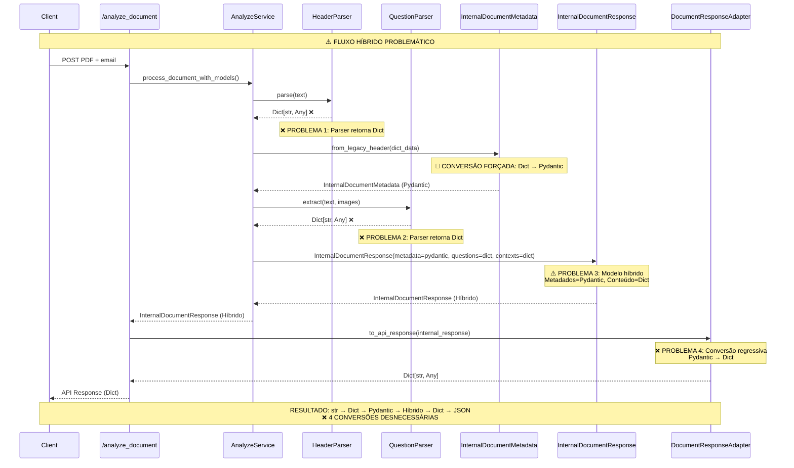
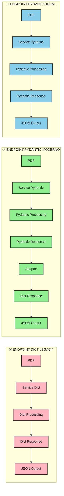
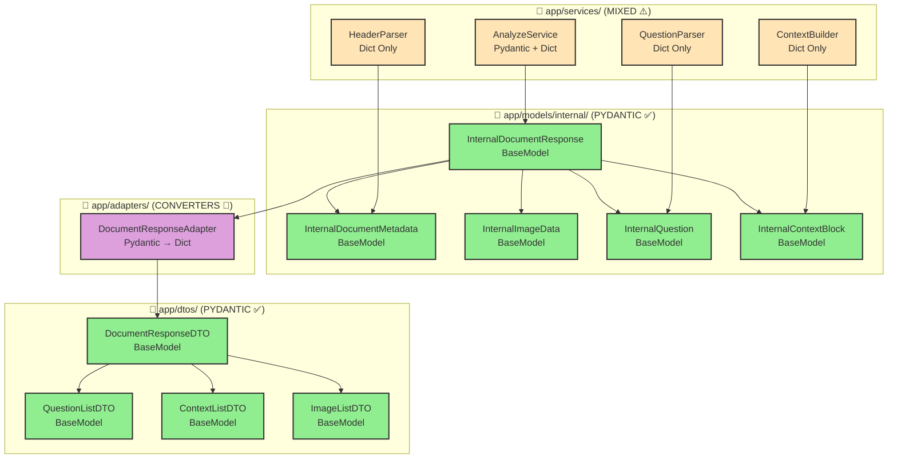
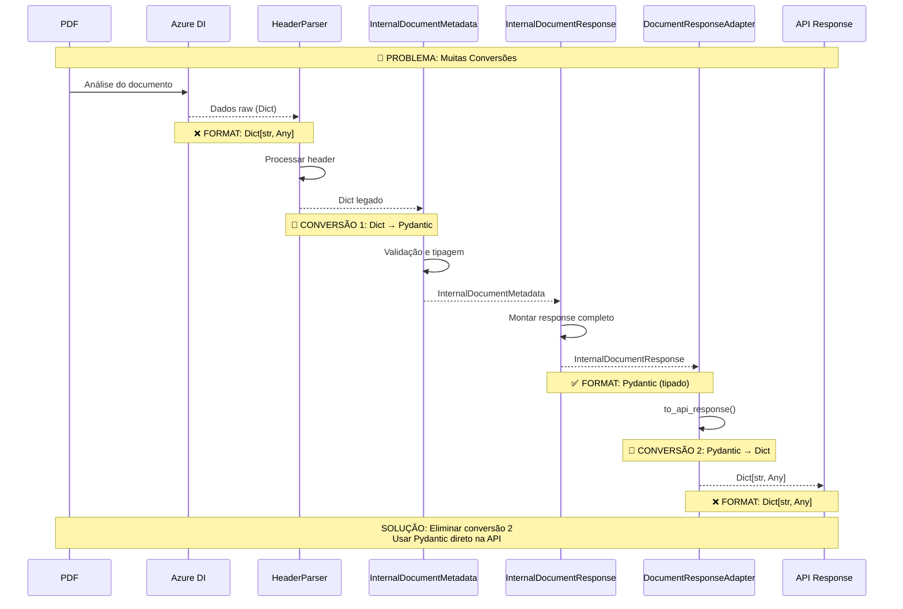
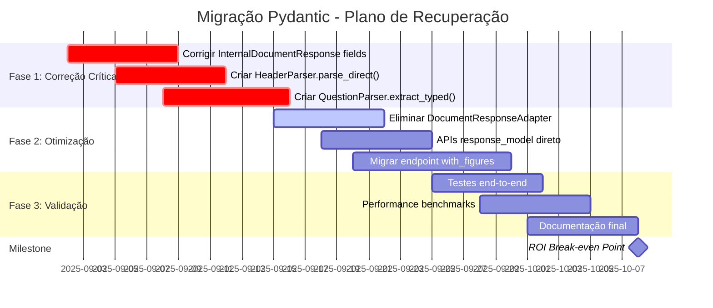
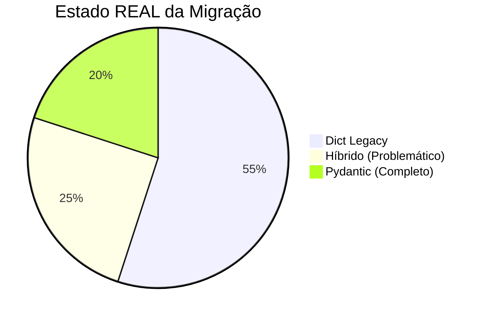
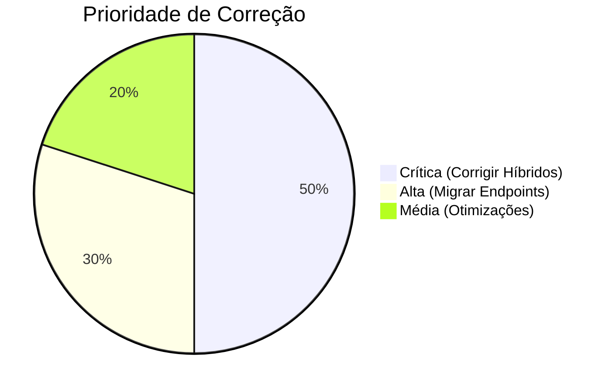
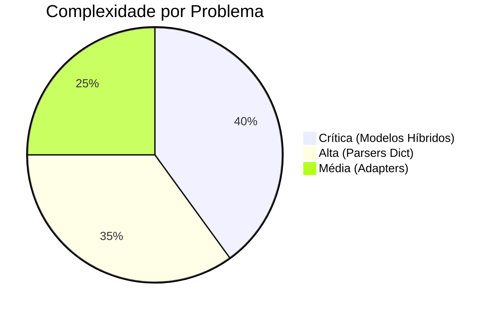

# 🎯 Diagramas Visuais: Pydantic vs Dict nos Fluxos

## 🔄 Diagrama 1: Fluxo REAL do Sistema (CORRIGIDO)

```mermaid
graph TD
    subgraph "📁 INPUT"
        A[📄 PDF File + Email]
    end
    
    subgraph "🔀 ENDPOINTS"
        B1[⚠️ /analyze_document<br/>HÍBRIDO]
        B2[📚 /analyze_document_mock<br/>DICT]
        B3[📊 /analyze_document_with_figures<br/>DICT]
    end
    
    subgraph "⚙️ SERVICES LAYER"
        C1[AnalyzeService<br/>.process_document_with_models<br/>→ Híbrido Pydantic/Dict]
        C2[DocumentProcessingOrchestrator<br/>.process_from_saved_azure<br/>→ Dict]
        C3[AnalyzeService<br/>.process_document<br/>→ Dict]
    end
    
    subgraph "🧱 MODELS/DATA"
        D1[⚠️ InternalDocumentResponse<br/>BaseModel + Dict fields<br/>HÍBRIDO ⚠️]
        D2[📊 Dict[str, Any]<br/>LEGACY ❌]
        D3[📊 Dict[str, Any]<br/>LEGACY ❌]
    end
    
    subgraph "🔄 ADAPTERS"
        E1[DocumentResponseAdapter<br/>Híbrido → Dict<br/>❌ REGRESSIVO]
        E2[No Adapter<br/>Dict Pass-through]
        E3[No Adapter<br/>Dict Pass-through]
    end
    
    subgraph "📤 OUTPUT"
        F1[❌ API Response<br/>Dict[str, Any]]
        F2[❌ API Response<br/>Dict[str, Any]]
        F3[❌ API Response<br/>Dict[str, Any]]
    end
    
    A --> B1
    A --> B2
    A --> B3
    
    B1 --> C1
    B2 --> C2
    B3 --> C3
    
    C1 --> D1
    C2 --> D2
    C3 --> D3
    
    D1 --> E1
    D2 --> E2
    D3 --> E3
    
    E1 --> F1
    E2 --> F2
    E3 --> F3
    
    classDef hybrid fill:#FFE4B5,stroke:#333,stroke-width:2px
    classDef dict fill:#FFB6C1,stroke:#333,stroke-width:2px
    classDef regressive fill:#FF6347,stroke:#333,stroke-width:2px
    
    class B1,C1,D1,E1,F1 hybrid
    class B2,C2,D2,E2,F2,B3,C3,D3,E3,F3 dict
    class E1 regressive
```

## 🔄 Diagrama 2: Conversões PROBLEMÁTICAS no Endpoint "Migrado"



## 🔄 Diagrama 3: Comparação de Complexidade



## 🔄 Diagrama 4: Mapa de Modelos no Sistema



## 🔄 Diagrama 5: Problemas de Performance nas Conversões



## 🔄 Diagrama 6: Roadmap de Migração CORRIGIDO



## 📊 Estatísticas de Migração

### Distribuição REAL de Formatos


### Prioridades CORRIGIDAS de Migração


### Complexidade REAL de Migração

