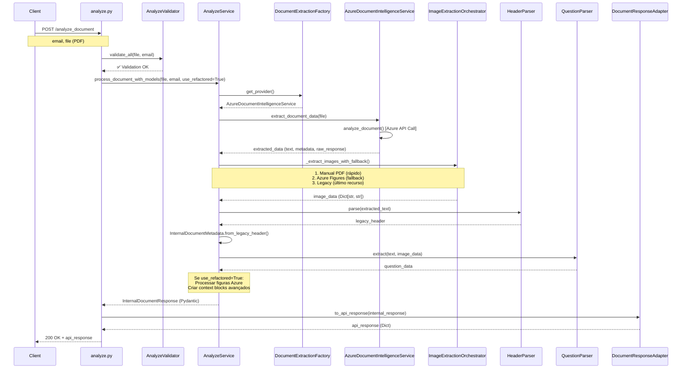
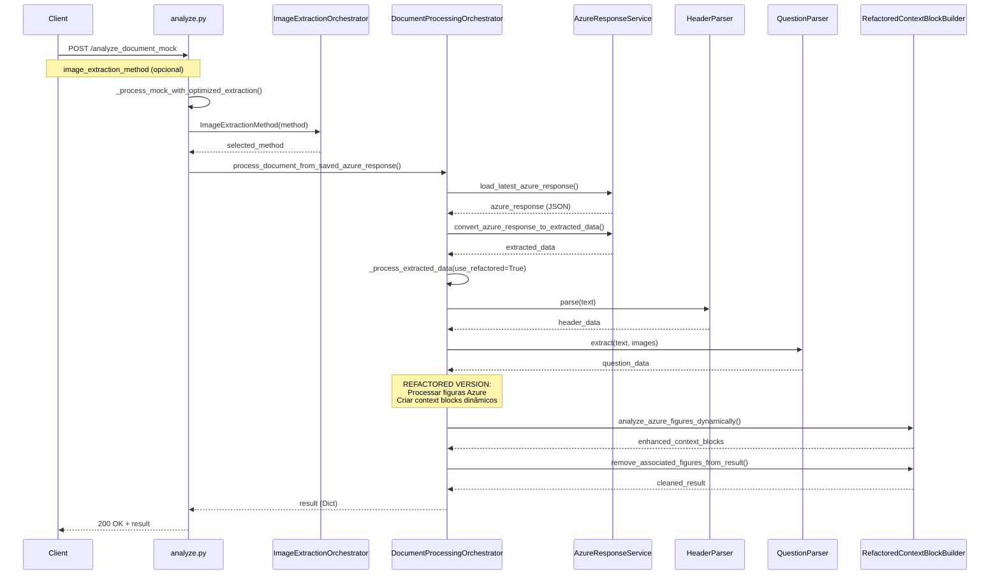
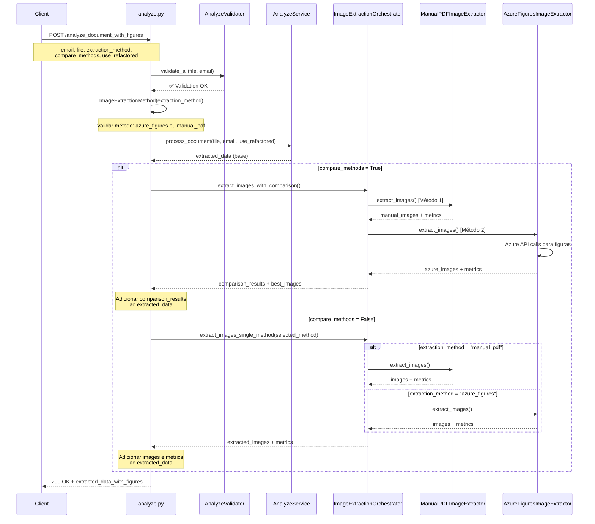

# Diagramas de Sequência - Endpoints de Análise

## 1. Endpoint `/analyze_document` - Fluxo Principal

## 2. Endpoint `/analyze_document_mock` - Fluxo Mock

## 3. Endpoint `/analyze_document_with_figures` - Fluxo Especializado

## 📊 Comparação Detalhada dos Fluxos

### **Complexidade de Processamento**

| Endpoint | Complexidade | Tempo Estimado | API Calls Azure |
|----------|--------------|----------------|-----------------|
| `/analyze_document` | Alta | 15-30s | 1 (análise) + 0-1 (imagens fallback) |
| `/analyze_document_mock` | Baixa | 1-3s | 0 (usa dados salvos) |
| `/analyze_document_with_figures` | Variável | 5-60s | 1-3 (dependendo do método) |

### **Estratégias de Extração de Imagens**

| Endpoint | Estratégia | Métodos Disponíveis | Fallback |
|----------|------------|---------------------|----------|
| `/analyze_document` | Automática com fallback | Manual PDF → Azure Figures → Legacy | ✅ Sim |
| `/analyze_document_mock` | Configurável | Manual PDF (recomendado) | ❌ Não |
| `/analyze_document_with_figures` | Específica ou comparativa | Azure Figures, Manual PDF | ❌ Não |

### **Casos de Uso Recomendados**

| Endpoint | Cenário Ideal | Vantagens | Limitações |
|----------|---------------|-----------|------------|
| `/analyze_document` | **Produção principal** | Tipagem forte, fallback automático, performance otimizada | Maior complexidade |
| `/analyze_document_mock` | **Desenvolvimento/testes** | Rápido, sem consumo de API, reproduzível | Dados limitados aos salvos |
| `/analyze_document_with_figures` | **Análise especializada** | Controle fino, comparação de métodos, métricas detalhadas | Sem fallback automático |

## 🔄 Fluxos de Dados Principais

### **Modelos de Resposta**

1. **`/analyze_document`**: `InternalDocumentResponse` → `DocumentResponseAdapter` → API Response
2. **`/analyze_document_mock`**: Dict direto (formato legado)
3. **`/analyze_document_with_figures`**: Dict + métricas de extração

### **Processamento de Figuras**

- **Endpoint principal**: Integrado no fluxo com `RefactoredContextBlockBuilder`
- **Mock**: Usa dados pré-processados do Azure
- **Figures**: Foco específico na extração e comparação de métodos